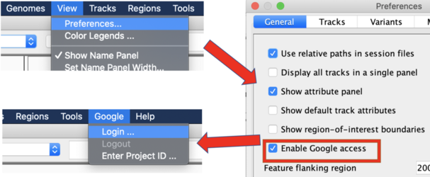
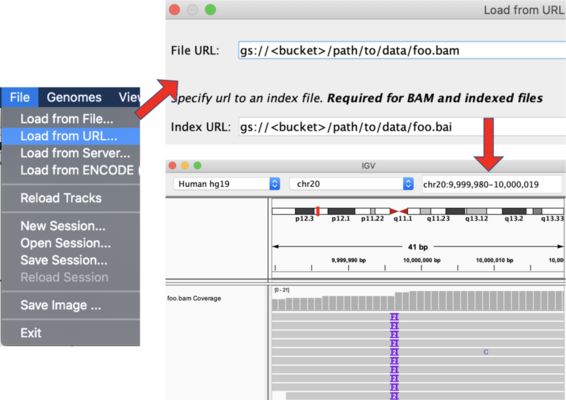

# IGV

- [IGV](#igv)
  - [Usage with GCP](#usage-with-gcp)
  - [Usage with Jupyter Notebooks & RMarkdown](#usage-with-jupyter-notebooks--rmarkdown)

IGV ([Integrative Genomics Viewer](https://igv.org/)) is a popular bioinformatic
tool used for the scalable visualisation of genomics data and annotations in
several file formats (e.g. BAM, CRAM, VCF, BED etc.).

For installation of the Java desktop application, follow the
[download instructions](https://software.broadinstitute.org/software/igv/download)
Mac users can extract the App from the downloaded zip file and drag it into
their Applications folder.

There is also a JavaScript version ([igv.js](https://github.com/igvteam/igv.js))
which can be embedded in websites and other reporting tools (e.g. Jupyter
Notebooks, RMarkdown HTML reports).

## Usage with GCP

IGV has support for visualising data in Google Cloud Storage. You need to enable
it with the following:

- Go to `View` -> `Preferences` and select `Enable Google Access`. Click `Save`,
  then quit and re-open IGV. You should now see a new `Google` item at the top
  menu bar.

- Go to `Google` -> `Login` and follow the authorisation prompts. Then go to
  `File` -> `Load from URL...`, fill in the full path to the GCS file of
  interest and its index (if required). The selected file should now show up in
  an IGV track.

## Usage with Jupyter Notebooks & RMarkdown

The following might be useful for setting up quick IGV explorations of data in
Jupyter Notebooks or RMarkdown reports (**TODO @pdiakumis**):

- **igv-jupyter** (from IGV team):
  - [GitHub repo](https://github.com/igvteam/igv-jupyter)
- **ipyigv** (from QuantStack):
  - [GitHub repo](https://github.com/QuantStack/ipyigv)
  - [Blog post](https://blog.jupyter.org/genomic-data-representation-in-jupyter-c57a5bb518d6)
- **igvR** (R Bioconductor package):
  - [GitHub repo](https://github.com/paul-shannon/igvR)
  - [Bioconductor](https://bioconductor.org/packages/release/bioc/html/igvR.html)
  - [Website](https://paul-shannon.github.io/igvR/index.html)
