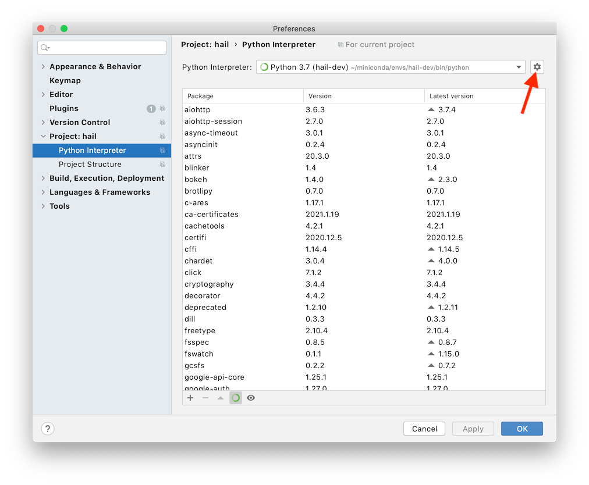
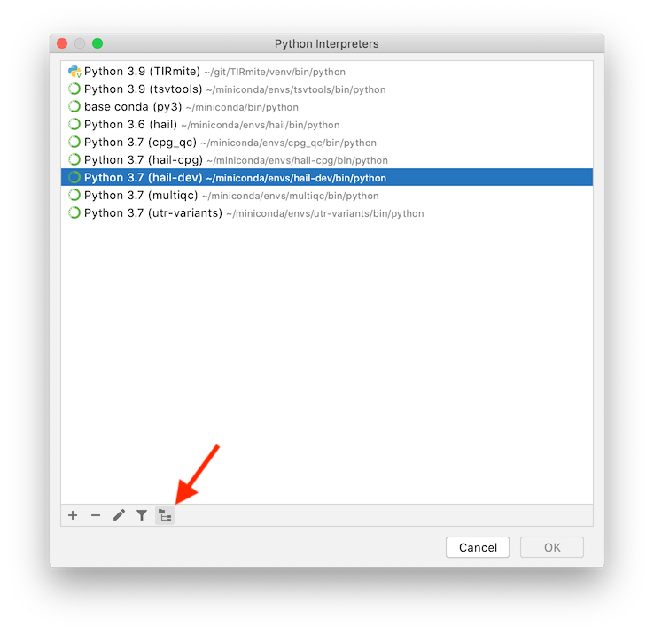

# Code Editors

We're flexible at the centre, but a majority of us use VSCode, or PyCharm.

- [Code Editors](#code-editors)
  - [Hail](#hail)
    - [Hail in Visual Studio Code](#hail-in-visual-studio-code)
    - [Hail in PyCharm](#hail-in-pycharm)
  - [WDL](#wdl)

## Visual Studio Code

VSCode is the most prominent IDE at the centre as it very quickly supports languages, extensions and code sharing.

### VSCode - Python

For Python, we recommend enabling the following settings:

- Black formatter (on save)
- Type Checking: strict (through your `settings.json`)
- Ruff
- iSort (configure the extra `black` mode in your `settings.json`)


Some cherry-picked `settings.json` options that might be handy:

```json
{
    "python.analysis.typeCheckingMode": "strict",
    "isort.args": [
        "--profile=black"
    ],
    "[python]": {
        "editor.formatOnType": true,
        "editor.rulers": [
            {
                "column": 88,
                "color": "#ff9900"
            }
        ],
        "editor.formatOnSave": true,
        "editor.defaultFormatter": "ms-python.black-formatter",
        "editor.codeActionsOnSave": {
            "source.organizeImports": "explicit",
            "source.fixAll": "explicit"
        },
    },

}
```

## Hail

### Hail in Visual Studio Code

#### Python

The Hail team allows line lengths up to 120 characters. In your _Preferences_, select the _Workspace_ tab and search for _Python › Formatting: Black Args_. Set the arguments to `--skip-string-normalization --line-length=120` to prevent `black` from adding lots of formatting changes that will make diffs hard to read.

After installing the Python extension, Visual Studio Code by default uses Pylance for code navigation. As Hail requires a non-trivial `PYTHONPATH` to resolve all modules, this is a little tricky to set up.

Add a `.env` file to the main Hail directory, which can be used to set up environment variables. Unfortunately, environment variable substitutions like `$HOME` don't work in this file, so you'll have to use absolute paths. Add the following line, adjusted accordingly for your system and user name:

```sh
PYTHONPATH="/Users/leo/hail:/Users/leo/hail/hail/python:/Users/leo/hail/gear:/Users/leo/hail/web_common"
```

At the time of writing, the Pylance build just got a [fix](https://github.com/microsoft/pylance-release/issues/275) to respect the `$PYTHONPATH` variable. However, it requires a new version of the Python (not Pylance!) extension. You can [switch](https://devblogs.microsoft.com/python/python-in-visual-studio-code-august-2019-release/) to that using the "Python: Insiders Channel" command.

Finally, you'll have to set up a Python environment. Open a terminal in Visual Studio Code and run the following to install the required dependencies:

```bash
venv hail
pip3 install -r hail/python/requirements.txt
pip3 install -r docker/requirements.txt

# this puts the current python version on the clipboard
which python | pbcopy
```

Switch Visual Studio Code to this cvirtualonda environment using the "Python: Select Interpreter" command. You might also want to disable the [inheritEnv setting](https://github.com/microsoft/vscode-python/issues/7607).

If symbols still don't get resolved properly, you might have to reload Visual
Studio Code.

#### Scala

If you're working on Hail's Scala code, the setup is slightly different. Assuming you've cloned the Hail repository to `$HAIL`, make sure that you open the `hail` subdirectory in Visual Studio Code, i.e. `$HAIL/hail` instead of `$HAIL`. That's necessary because the Gradle configuration is located at `$HAIL/hail/build.gradle`.

- Install the [Scala (Metals)](https://marketplace.visualstudio.com/items?itemName=scalameta.metals) extension from the Marketplace.
- Verify that `build.gradle` contains the Bloop-related changes from
  [#111](https://github.com/populationgenomics/hail/pull/111/files).
- From the `$HAIL/hail` directory, run:

  ```bash
  make elasticsearchJar
  ./gradlew bloopInstall
  ```

- Back in Visual Studio Code, run the _Metals: Import build_ command. This might take a few minutes to complete.
- Make sure everything worked out by running the _Metals: Run doctor_ command. It should look like this:
 

### Hail in PyCharm

Create a new PyCharm project using the Hail source directory.

Then create a development codna environment:

```bash
venv hail-dev

pip3 install -r hail/python/requirements.txt
pip3 install -r docker/requirements.txt

# this puts the current python version on the clipboard
which python | pbcopy
```

Now you will need to configure PyCharm to use this environment. Go to the main PyCharm `Preferences`, which will open up a separate window. In the left pane, choose `Project: hail`>`Project Interpreter`. Now, in the main pane on the right, click the settings symbol (gear symbol) next to the field for `Project Interpreter`:



Choose `Add` in the menu that pops up, and select `Existing environment`:


Click on the ellipsis symbol next to the field for `Interpreter`. Enter the path to python interpreter (you could get this by running `which python` in the virtual environment), e.g. `/Users/michael.franklin/.venv/analysis-runner/bin/python`.

Now, same as for Visual Studio Code, you will need to set up PyCharm to resolve some Hail modules like `gear` and `web_common` that require a non-trivial `PYTHONPATH`. Go back to `Preferences`>`Project: hail`>`Project Interpreter`, and click the settings gear symbol again.

Now choose `Show All` in the menu that pops up. Pick the interpreter you are using for this project and click on the tree symbol at the bottom of the window (hovering over the symbol reveals it as "Show paths for the selected interpreter"):



Add the paths to the `gear`, `web_common`, `batch` folders in the repository root by clicking in the "plus" symbol:


Now PyCharm should resolve internal module imports in the code.

## WDL

There are two runners for WDL:

1. [Cromwell](https://github.com/broadinstitute/cromwell) / WOMTool (for validating)
1. [MiniWDL](https://github.com/chanzuckerberg/miniwdl)

It's recommended to validate with both WOMTool (the Cromwell validator) and MiniWDL, as sometimes they can return inconsistent results. You can validate a workflow called `workflow.wdl` with:

```shell
java -jar womtool-63.jar validate <workflow.wdl>
miniwdl check <workflow.wdl
```

### WDL in Visual Studio Code

In VSCode, we'd recommend installing the [WDL DevTools extension for Visual Studio Code](https://marketplace.visualstudio.com/items?itemName=broadinstitute.wdl-devtools). It provides syntax highlighting, and uses MiniWDL to provide immediate feedback about syntax and linting.

Installing [shellcheck](https://github.com/koalaman/shellcheck#:~:text=ShellCheck-,on%20macos,-OS) will give you additional linting support within the command block.
