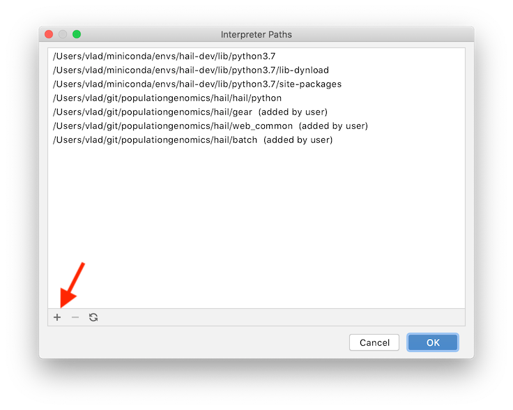

# Code Editors

- [Code Editors](#code-editors)
  - [Setting up Hail](#setting-up-hail)
    - [Visual Studio Code](#visual-studio-code)
    - [PyCharm](#pycharm)

## Setting up Hail

### Visual Studio Code


After installing the Python extension, Visual Studio Code by default uses
Pylance for code navigation. As Hail requires a non-trivial `PYTHONPATH` to
resolve all modules, this is a little tricky to set up.

Add a `.env` file to the main Hail directory, which can be used to set up
environment variables. Unfortunately, environment variable substitutions like
`$HOME` don't work in this file, so you'll have to use absolute paths. Add the
following line, adjusted accordingly for your system and user name:

```sh
PYTHONPATH="/Users/leo/hail:/Users/leo/hail/hail/python:/Users/leo/hail/gear:/Users/leo/hail/web_common"
```

At the time of writing, the Pylance build just got a
[fix](https://github.com/microsoft/pylance-release/issues/275) to respect the
`$PYTHONPATH` variable. However, it requires a new version of the Python (not
Pylance!) extension. You can
[switch](https://devblogs.microsoft.com/python/python-in-visual-studio-code-august-2019-release/)
to that using the "Python: Insiders Channel" command.

Finally, you'll have to set up a Python environment. Open a terminal in Visual
Studio Code and run the following to install the required dependencies:

```bash
conda create --name hail-dev python=3.7.7
conda activate hail-dev
pip3 install -r hail/python/requirements.txt
pip3 install -r docker/requirements.txt
```

Switch Visual Studio Code to this conda environment using the "Python: Select
Interpreter" command. You might also want to disable the
[inheritEnv setting](https://github.com/microsoft/vscode-python/issues/7607)
when using conda.

If symbols still don't get resolved properly, you might have to reload Visual
Studio Code.

### PyCharm

Create a new PyCharm project using the Hail source directory.

Then create a development codna environment:

```bash
conda create --name hail-dev python=3.7.7
conda activate hail-dev
pip3 install -r hail/python/requirements.txt
pip3 install -r docker/requirements.txt
```

Now you will need to configure PyCharm to use this environment. Go to the
main PyCharm `Preferences`, which will open up a separate window.
In the left pane, choose `Project: hail`>`Project Interpreter`. Now,
in the main pane on the right, click the settings symbol (gear symbol)
next to the field for `Project Interpreter`:


Choose `Add` in the menu that pops up, and select `Existing environment`:


Click on the ellipsis symbol next to the field for `Interpreter`. Enter
the path to python interpreter, e.g. `/Users/vlad/miniconda/envs/hail-dev/bin/python`.

Now, same as for Visual Studio Code, you will need to set up PyCharm to resolve
some Hail modules like `gear` and `web_common` that require a non-trivial
`PYTHONPATH`. Go back to `Preferences`>`Project: hail`>`Project Interpreter`,
and click the settings gear symbol again.

Now choose `Show All` in the menu that pops up. Pick the
interpreter you are using for this project and click on the tree symbol at
the bottom of the window (hovering over the symbol reveals it as
"Show paths for the selected interpreter"):


Add the paths to the `gear`, `web_common`, `batch` folders in the repository
root by clicking in the "plus" symbol:



Now PyCharm should resolve internal module imports in the code.
