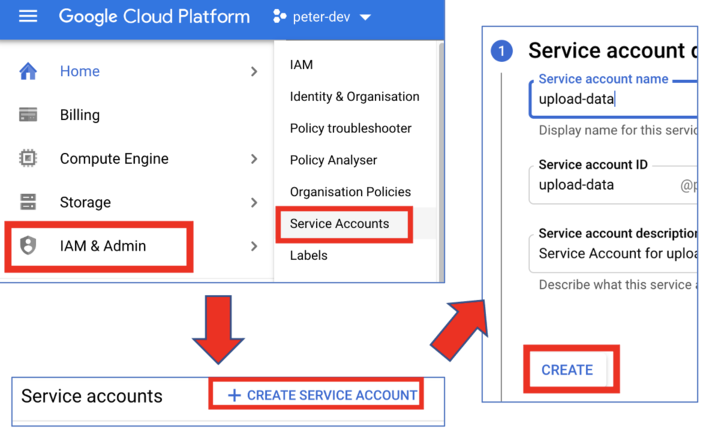
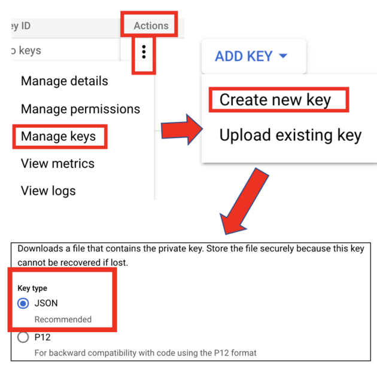
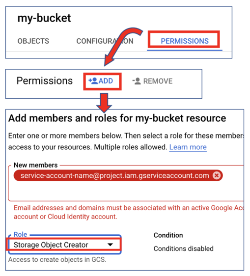

# Data Sharing

- [Data Sharing](#data-sharing)
  - [Step 1: Create a service account](#step-1-create-a-service-account)
  - [Step 2: Create a key](#step-2-create-a-key)
  - [Step 3: Add bucket permissions](#step-3-add-bucket-permissions)
  - [Step 4: Upload the data](#step-4-upload-the-data)

If a collaborator wants to upload data to a GCS bucket, you can follow this
process to set up a service account that can be used to upload the data on their
behalf:

## Step 1: Create a service account

- Log into your GCP account and select the project that contains the bucket in
  which the data will be uploaded.
- `IAM & Admin` → `Service Accounts` → `Create Service Account`.
- Fill in the service account name - the ID should be filled in automatically.
- (Optional) Add a description of the service account.
- `Create`.



## Step 2: Create a key

- Locate your newly created service account in the main service account table.
- Under the `Actions` column, select the triple dot icon, then select:
  `Manage keys` → `ADD KEY` → `Create new key` → `Key type: JSON` → `Create`.
- A JSON file should automatically download through your browser. **IMPORTANT**:
  this contains a private key so it should be treated as a sensitive password
  i.e. do not share this publicly (it's okay to share with your collaborator;
  just inform them it's private).



## Step 3: Add bucket permissions

- Select the bucket in which the data will be uploaded.
- Select `Permissions` → `ADD`.
- Add the name of the service account you created in Step 1 under `New members`.
- Select/find the `Storage Object Creator` Role.
- `Save`



## Step 4: Upload the data

These are the only steps needed to be followed by the collaborator:

- Install the
  [Google Cloud SDK](https://cloud.google.com/sdk/docs/install#linux) tools
  (there's also a
  [conda package](https://anaconda.org/conda-forge/google-cloud-sdk) if you're
  familiar with conda).

- You (or the collaborator, provided you've sent them the JSON key from above)
  can then run the following:

```bash
gcloud auth activate-service-account --key-file=<project-ID-numbers>.json  # this only needs to be run once
gsutil -m cp -r data_to_upload gs://<my-bucket>/data/ # the service account only has upload permissions
```
