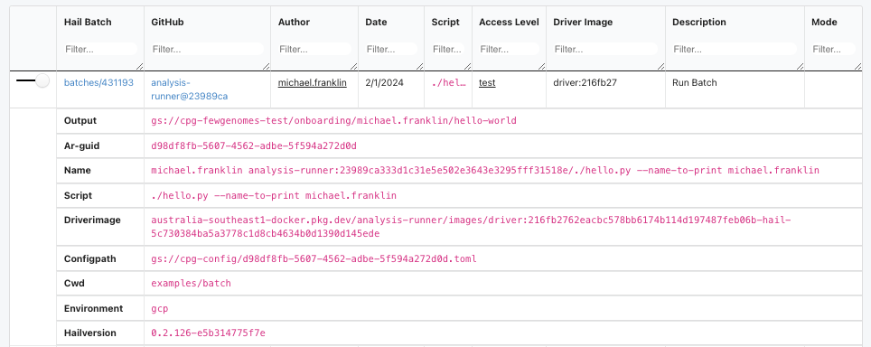

# Analysis-runner

As explained in other docs [Getting Started #Analysis-runner](/getting_started.md#analysis-runner), and [Reproducible analysis](/reproducible_analyses.md), the analysis-runner is the gate keeper of running analysis at the CPG.

We don't allow users to run scripts directly on production data, we require code to be commited, reviewed, and then ran. The analysis-runner is the mechanism we use for that indrection. The analysis-runner builds a Batch pipeline from a specific commit in a GitHub repository.

You can sort of think of it like a HPC job manager (like Slurm / PBS).

In this exercise, we'll run some existing code through the analysis-runner, modify it and run it again.

## Preconditions

You'll need to:

- have git + GitHub set up
- be added to the `populationgenomics` GitHub organisation
- ensure an account with Hail Batch has been created
- be added to the fewgenomes analysis group (speak to your manager if you're unsure about this one)
- have the analysis-runner CLI tool installed

    - we recommend creating a virtual environment (see [Python](/python.md) for setting up python, and a virtual env trick), and installing the `analysis-runner`.

        ```shell
        virtualenv analysis-runner
        pip install analysis-runner

        analysis-runner --version
        # analysis-runner v2.43.3
        ```

## Running code via the analysis-runner

We're going to run the `examples/batch/hello.py` Hail Batch workflow via the analysis-runner. This code example is conveniently located in the analysis-runner github repository.

```shell
git clone git@github.com:populationgenomics/analysis-runner.git
cd analysis-runner
```

### The batch to run

Let's take a look at the example:

```python
from shlex import quote

import click
from cpg_utils.hail_batch import get_batch


@click.command()
@click.option('--name-to-print')
def main(name_to_print):
    """Runs test hail batch workflow"""

    b = get_batch()

    j1 = b.new_job('first job')
    # For Hail batch, j.{identifier} will create a Resource (file)
    # that will be collected at the end of a job
    stdout_of_j = j1.out
    string_to_print = f'Hello, {name_to_print}'
    j1.command(f'echo {quote(string_to_print)} > {stdout_of_j}')

    j2 = b.new_job('second job')
    # for the second job, using an f-string with the resource file
    # will tell batch to run j2 AFTER j1
    j2.command(f'cat {stdout_of_j}')

    # use wait=False, otherwise this line will hang while the sub-batch runs
    # bad for running hail batch within a hail batch, as preemption
    b.run(wait=False)


if __name__ == '__main__':
    main()  # pylint: disable=no-value-for-parameter
```

This script sets up a two-step Hail batch workflow:

1. the first job generates a personalized greeting, writing the contents to a file, and 
1. the second job prints that greeting.

The `wait=False` parameter during the run ensures that the script doesn't hang while waiting for the batch to complete, which is particularly useful when running Hail batch within another Hail batch.

This tests spinning up multiple containers, job dependencies and passing intermediate files.

### Running the code

We can run this file through the analysis-runner with.

```shell
cd examples/batch
analysis-runner \
    --access-level test \
    --dataset fewgenomes \
    --description "Run Batch" \
    --output-dir "onboarding/$(whoami)/hello-world" \
    hello.py \
    --name-to-print $(whoami)

# Running this command should print something like:
# Submitting analysis-runner@<commit-sha> for dataset "fewgenomes"
# Request submitted successfully: https://batch.hail.populationgenomics.org.au/batches/431193
```

Running this command will print a batch link - first let's break this command down:

- Dataset: `fewgenomes`:
    - This is where we allocate the cost of the analysis too,
    - Used in coordination with the namespace to decide the set of buckets we can read / write from,
    - NB: The dataset [allowlists](https://github.com/populationgenomics/cpg-infrastructure-private/blob/main/tokens/repository-map.json) a series of repositories that can be run against it.
- Access level: `test`:
    - The namespace of the analysis
    - Used in coordination with the dataset to decide the set of buckets we can read / write from
- `output-dir`:
    - Not used in this script, but combined with the dataset, namespace, category to derive a complete output path.
- `description`: Stored in the analyis-runner log as a human readable description of the task.
- `hello.py --name-to-print $(whoami)`:
    - The command we want the analysis-runner to run. Note that the `$(whoami)` is evaluated client side.


Implicitly, the analysis runner has grabbed:

- The repository: by grabbing the repo name from the default git remote `origin`
- The commit: by grabbing the commit sha of the current `HEAD`
- The _relative_ cwd: from the git root (ie: `examples/batch`)

### Inspecting the batch

Alright! Let's take a look at the batch, it should have the format `https://batch.populationgenomics.org.au/batches/<batch-id>/jobs/1`.

Our _driver_ batches only contain one job called "driver" (this may change with Hail Batch Job Groups). Have a look around this page, at the moment we're most interested in the _Command_ and _Logs_.

The driver job:

1. Activates the service account credentials for the required account, in this case, the `fewgenomes-test` hail service account.
1. Loads up git credentials in case we're checking out a private repository.
1. Clones the requested repository (`fewgenomes`)
1. Checks out the specific commit (on our `main` namespace, we'd check that you commit is on the main branch).
1. Change to the requested directory
1. Runs the command!

Also, take note of the `CPG_CONFIG_PATH` environment variable, we'll have a look at this later.

As our code is itself submitting another Hail Batch, in the logs you'll find something like:

```
Submitted batch 431194, see https://batch.hail.populationgenomics.org.au/batches/431194
```

If we go to that batch, we'll see two jobs!

1. The first job:

    - Puts the string "Hello, <name>" into a file:

        ```
        # other setup stuff here
        echo 'Hello, michael.franklin' > ${BATCH_TMPDIR}/first_job-3AIfz/out
        ```

    - Copies this output to google cloud storage.
    - Can you find:
        - The image this job is running the command in?
        - The `gs://` location where this intermediate file is writing to?

1. The second job:

    - Prints the contents of the file from the first job to our standard out (logs).

Great work!


### Analysis-runner log

Now, let's take a look at the analysis-runner log: [https://sample-metadata.populationgenomics.org.au/analysis-runner/fewgenomes-test](https://sample-metadata.populationgenomics.org.au/analysis-runner/fewgenomes-test).



We should have enough information here to re-run the job.

### CPG_CONFIG_PATH

The configurations are a big part of our portable analysis methodology. This allows you to run the same code, across multiple datasets, namespaces and even clouds without any change to your code. A TOML file is another key-value file format.

You should have access to view the config locally, for example:

```
gsutil cat gs://cpg-config/d98df8fb-5607-4562-adbe-5f594a272d0d.toml | less
```

The `[workflow]` section by default contains sections associated with your analysis-runner invocation.

If you scroll down, you can see the `[storage.default]` section, which is how we decide where to write files to. You can see the different categories of buckets we have available:

```toml
[storage.default]
analysis = "gs://cpg-fewgenomes-test-analysis"
default = "gs://cpg-fewgenomes-test"
tmp = "gs://cpg-fewgenomes-test-tmp"
upload = "gs://cpg-fewgenomes-test-upload"
web = "gs://cpg-fewgenomes-test-web"
web_url = "https://test-web.populationgenomics.org.au/fewgenomes"
```

The analysis-runner allows you to specify additional config files which get merged left-to-right. Noting, you can't override the `access_level` / `dataset` fields.

Configurations like this can make it tricky to work out exactly where parameters come from, we recommend:

- Putting the parameter on the CLI if it's the value is unique for each run
- Putting the parameter in a config if it's useful for many runs to have this value, and it changes predictably with the dataset.
- And we discourage using environment variables to pass around information.

## A new workflow run

Woah, that was a lot of info! Now let's modify the original workflow, and run the modified code through the analysis-runner!

As we need our code to be pushed to GitHub, and our `main` branches are protected, we'll need to create a branch:

```
git checkout -b onboarding-example-YOURNAME
```

Make some change to the workflow, you could consider:

- Changing the string to print
- Changing the name of the jobs to include the name to print
- Advanced: reducing the amount of resources allocated to the job (see [Hail Batch Job Resources](/hail.md#hail-batch-job-resources) for more information).

After you've made the change, commit, push and rerun!

```shell
git commit -m '<your commit message>'
git push
```

Now kick off the analysis-runner again:

```
analysis-runner \
    --access-level test \
    --dataset fewgenomes \
    --description "Run Batch" \
    --output-dir "onboarding/$(whoami)/hello-world" \
    hello.py \
    --name-to-print $(whoami)
```

How'd you go?!


## Wrapping up

Great work! You've now been exposed to analysis at the CPG, from a script on your computer, to running also limitlessly on the cloud! 

Just to recap:

- Modifying code, pushing to a populationgenomics GitHub repo
- Directly interacted with the analysis-runner
- Analysed batches and jobs on Hail Batch
- Seen how configs are used at the CPG.
- Interacted (briefly) with Metamist!
