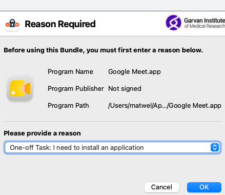

# Setup

This identifies a couple of key steps in setting up your new laptop for authenticating against and interacting with CPG resources. Some are essential for interacting with compute and data, some are personal preference.

## Permission To Install

Depending on the institute your hardware has been provided by, the restrictions may vary. If your device was provided by Garvan IT, you should have a taskbar daemon called `Endpoint Privilege Management`. When you try to install software this will often pop up, prompting you to provide a reason for the action, usually "required for a one-time installation" will remove the block and allow you to complete an installation. If you are still unable to install software you require, raise this on the `#software-questions` Slack Channel.



## Slack

Key to communications at CPG, you should get Slack installed sharpish. Garvan staff can install Slack directly from the `Garvan IT Self Service` App, or you can source it from the [Slack download page](https://slack.com/intl/en-au/downloads/mac). Once installed, you will want to authenticate using `SSO`, which will route your login through a web browser.

## Zoom, Chrome

As with Slack, Garvan staff will find these available through the `self-service` application. For non-Garvan or manual installs you can download [Zoom](https://zoom.us/download) and [Chrome](https://www.google.com/intl/en_au/chrome/) download pages should be accessed directly.

`Google Meet` is fast replacing `Zoom` as the conferencing tool of choice at `CPG`. To download a desktop application for Meet'ings, follow instructions [here](https://support.google.com/meet/answer/12387350?hl=en&co=GENIE.Platform%3DDesktop) (requires Google Chrome):

1. On your computer, go to meet.google.com
2. At the top-right of your browser, in the URL bar, click `Install`
3. The Meet App will appear in your Dock

> **n.b.** the Meet app uses Google Chrome - if Chrome is uninstalled it will not work, and if you use CMD-Q to quit the Chrome browser during a Meet conference call, it will also close the Meet App.

## Terminal

If you are involved with data analysis or infrastructure management, you will spend a lot of time on the terminal. The MacOs default `Terminal` application is fine, but [ITerm2](https://iterm2.com/) should be strongly considered due to its wealth of advanced features (dividing tabs into split-panes, improved text search, command autocomplete, password manager, easily accessed command history, and more).

## Homebrew

See the [Homebrew page](homebrew.md) for instructions on how to install this handy package manager.

## XCode

If you install `Homebrew`, you won't need to install XCode manually. If you avoid Homebrew, XCode is a collection of MacOS developer tools (git, make, various compilers). You can install XCode from the [App Store](https://apps.apple.com/au/app/xcode/id497799835?l=en-GB&mt=12Xcode), or from the command line:

```bash
xcode-select --install
```

Once XCode is installed, you may need to activate your installation by agreeing to the software license agreement. Running `gcc` in a terminal will prompt you to run the license prompt, or you can access it directly through:

```commandline
sudo xcodebuild -license
```

## Git

GitHub is where CPG stores all its repositories. Once Git is installed (by `XCode`, if it's not already present on startup), you will need to authenticate your local git instance. See advice [here](git.md#connection-protocol) for information on setting up SSH and GPG keys to authenticate with GitHub. 

> **n.b.** when running `ssh-keygen` on a Mac, it may default to generating `rsa` keys. The `rsa` algorithm is not sufficiently secure and will be rejected by GitHub. You should use the `ed25519` algorithm instead.

## GCloud

The GCloud SDK is the main way to interact with Google Compute Resources through the command line, and the way to authenticate various applications to enable usage of the Google APIS. See [Gcloud](gcloud.md) for instructions.

## Analysis-Runner

At CPG we don't typically permit analysts to deploy jobs or scripts directly. Instead we have [Analysis-Runner](https://github.com/populationgenomics/analysis-runner) to broker interactions between the User and Cloud compute. The handy command line tool can be installed as a python package:

```bash
pip install analysis-runner
# or
uv pip install analysis-runner
```

In environments with `analysis-runner` installed you will be able to access the handy client using the `analysis-runner` command. See the [analysis-runner exercise](exercise-analysis-runner/README.md) for a worked example.

## Docker

[Docker](https://www.docker.com/) is a software containerisation tool, frequently used to build Docker Images for running software in Google's Cloud infrastructure.

>**Note**: When Docker images are built, they are compiled for a specific platform (i.e. a Docker Image built for Apple Silicon may not work as expected on Intel processors). You should always build a Docker Image for the hardware it is intended to be deployed on.

You can install Docker using [Homebrew](homebrew.md), or you can download [Docker Desktop](https://www.docker.com/products/docker-desktop/) to add a graphical user interface.

Most of our images are built using Continuous Integration (CI) workflows in GitHub, which ensures the build and deployment infrastructure are aligned. This can also result in much faster build times.

If you want to pull (or push) Docker Images from the GCP Artifactory, you will need to first install [GCloud](#gcloud), then you will need to configure your local Docker installation to use GCloud as an authentication method:

```commandline
gcloud auth configure-docker australia-southeast1-docker.pkg.dev
```

### OrbStack

If you have issues setting up/using Docker Desktop, and want to try a lightweight alternative, try [OrbStack](https://docs.orbstack.dev/)

## BCFtools and SAMtools

If you interact with genomic data formats, locally or in GCS, you will likely use both BCFtools and SAMtools. See the [setup guide here](bcftools_and_samtools.md), noting that for most users the majority of that guide can be replaced with a simple [Homebrew](homebrew.md) installation. The [Authentication](bcftools_and_samtools.md#auth-token) section would be relevant for all users interacting directly with files in GCP.

## DisplayLink

If you were provided with a Dock to connect your laptop to power/external monitors, you may need to download the [Synaptics DisplayLink Manager](https://www.synaptics.com/products/displaylink-graphics/downloads/macos).

## Hail Batch

If you plan to launch workflows using Hail Batch, and you have not previously set up an account, check out the section [here](hail.md#hail-batch-developer-setup) section for required steps.
