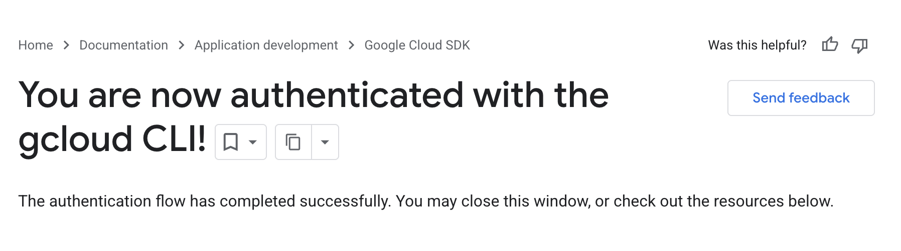

# GCloud

The GCloud CLI is an essential tool for authenticating and interacting with Google Cloud storage and compute resources.

## Installation

### Simple Install

If you already have [Homebrew](homebrew.md) installed, you can install GCloud that way:

```commandline
brew install gcloud-cli
```

### Download & Install

If you'd prefer to avoid Homebrew, you can download and install from the [GCloud CLI Downloads page](https://docs.cloud.google.com/sdk/docs/install-sdk)

## Authentication

Once the GCloud CLI is installed, you need to authenticate with your CPG Google account. These commands will open a browser window, where you can complete the login process:

```commandline
gcloud auth login
```

Once this is completed you should see a browser window confirming the login process is complete:




After login has been completed, you need to nominate a project to correctly allocate costs for all GCP interactions. Contact your people leader or the software team to select an appropriate project ID:

```text
gcloud config set project <PROJECT_ID>
```

## Application Default Credentials

Once you have personally authenticated with the gcloud CLI, you should also run the application-default login command. This provides a method to get credentials used in calling Google APIs:

```commandline
gcloud auth application-default login
```

This will take you through the same browser login process, with the same confirmation. Once you have logged in this way, you may also have to set the application-default quote project to correctly allocate costs:

```text
gcloud auth application-default set-quota-project <PROJECT_ID>
```

This is essential for generating an OAuth token for use in tools which access Google compute resources, e.g when using [BCFtools](bcftools_and_samtools.md) to access files in GCS:

```bash
export GCS_OAUTH_TOKEN=$(gcloud auth application-default print-access-token)
bcftools COMMAND [ARGS, ] 
```
