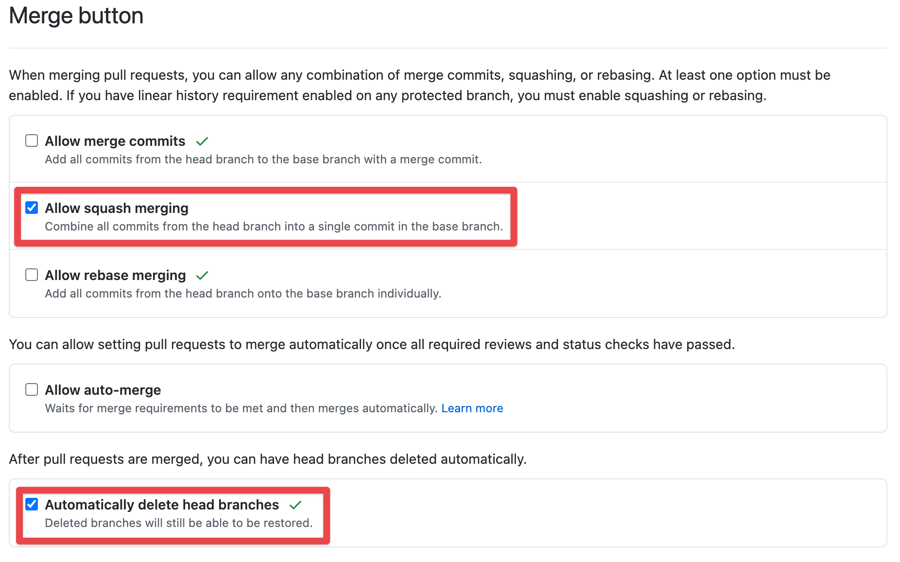
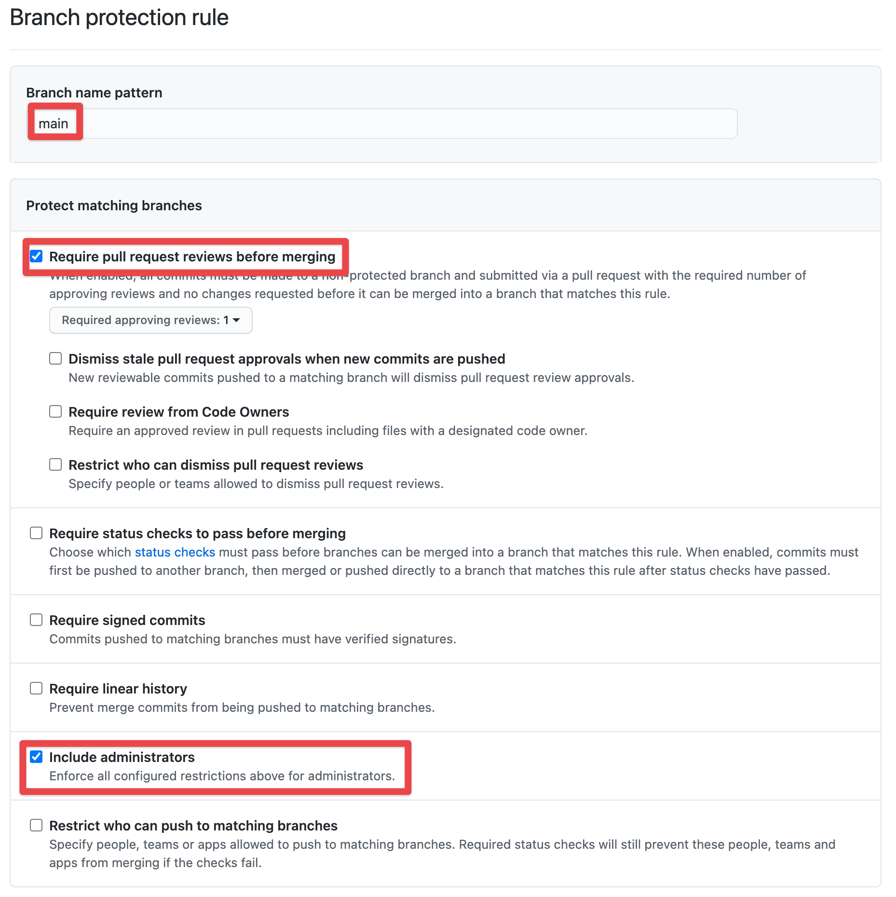
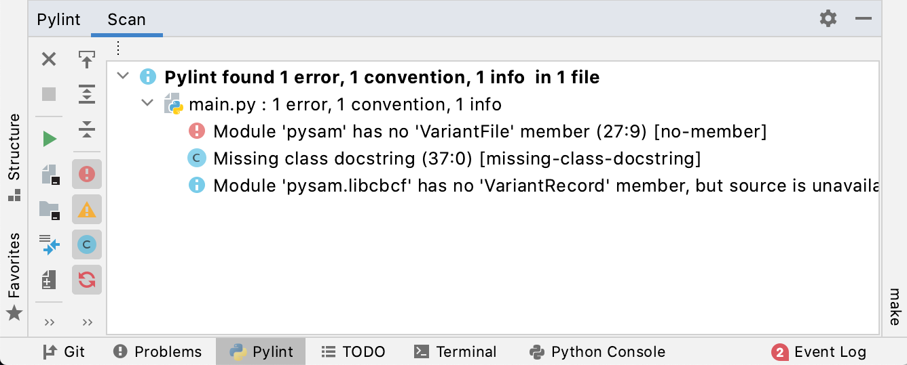
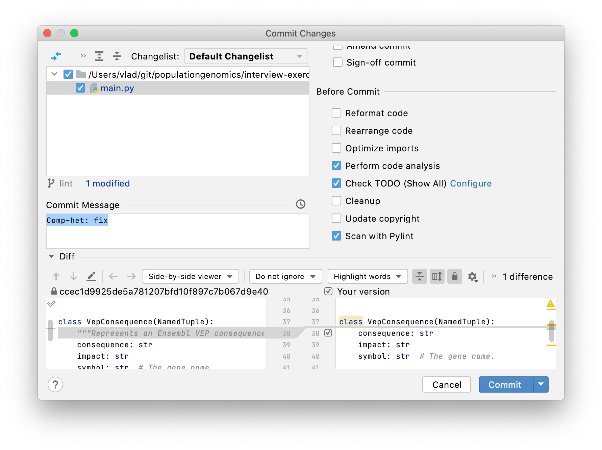
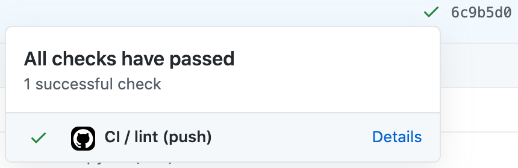

# Setting up a new repository

By default, all our repositories should be public, unless there's a specific reason
that's not possible.

After you have created a GitHub repository, you should change the following settings:



Only allow _merge commits_ for forks in which you'll incorporate upstream changes. Squash merging keeps the history much cleaner.

Under _Branches_, add a _branch protection rule_ to enforce reviews for the `main` branch:



Under _Manage Access_, add collaborators. Prefer to add teams instead of individual people. It's common to add `populationgenomics/software-team` and `populationgenomics/analysis-team` with _write_ permissions.

The next step is to initiate a `README.md`, add an MIT license, and a `.gitignore`
file, unless these files were already added previously via the GitHub web interface.

Following that, you may want to set up linters for code style and error checks, and -
if the project can be shipped as a package - set up versioning and automated artifact
builds. This document provides tips on how to set these things up.

- [Linters](#linters)
  - [Setting up pre-commit](#setting-up-pre-commit)
  - [Disabling inspections](#disabling-inspections)
  - [Visual Studio Code](#visual-studio-code)
  - [PyCharm](#pycharm)
- [Conda dev environment](#conda-dev-environment)
- [Setting up setup.py](#setting-up-setuppy)
- [Versioning project](#versioning-project)
- [GitHub Actions](#github-actions)
- [Packaging with conda](#packaging-with-conda)
  - [Setting up recipe](#setting-up-recipe)
  - [Adding GitHub Actions](#adding-github-actions)
- [Making a release](#making-a-release)
  - [Hail](#hail)

## Linters

To help us in implementing a consistent coding style throughout our code base, we use
git [pre-commit](https://github.com/pre-commit/pre-commit)
hooks with a set of linters that check and/or reformat the files in the repository.

- pre-commit comes with
  a [set of hooks](https://github.com/pre-commit/pre-commit-hooks#hooks-available) that
  perform some very useful inspections:
  - `check-yaml` to check YAML file correctness,
  - `end-of-file-fixer` that automatically makes sure every file ends with exactly one
    line end character,
  - `trailing-whitespace` that removes whitespace in line ends,
  - `check-case-conflict` checks for files with names that would conflict on a
    case-insensitive filesystems like MacOS,
  - `check-merge-conflict` check files that contain merge conflict strings,
  - `detect-private-key` checks for existence of private keys
  - `debug-statements` checks for debugger imports and py37+ breakpoint() calls in
    python source
  - `check-added-large-files` prevents giant files from being committed (larger than
    500kB);
- [markdownlint](https://github.com/igorshubovych/markdownlint-cli) checks the style of
  the Markdown code;
- [pylint](https://www.pylint.org/) and [flake8](https://flake8.pycqa.org/) check Python
  code style in accordance with [PEP8](https://www.python.org/dev/peps/pep-0008/), and
  perform some static analysis to catch potential programming
  errors. [flake8-quotes](https://github.com/zheller/flake8-quotes) is a plugin to
  flake8 that checks the consistency of quotes (we chose single quotes to be consistent
  with the [Hail project](https://github.com/hail-is/hail/pull/9931) code style);
- [black](https://github.com/psf/black) reformats Python code to make it conform
  to [PEP8](https://www.python.org/dev/peps/pep-0008/).

### Setting up pre-commit

When creating a new repository, please add these configuration files into the repository
root folder (you can skip the last 3 lines if you project is not going to contain any
Python code):

```sh
URL=https://raw.githubusercontent.com/populationgenomics/team-docs/main/new_repository
wget $URL/pre-commit-config.yaml -O .pre-commit-config.yaml
wget $URL/markdownlint.json -O .markdownlint.json
wget $URL/pyproject.toml -O pyproject.toml
wget $URL/pylintrc -O .pylintrc
wget $URL/flake8 -O .flake8
```

Install pre-commit and pylint into your project environment with pip or conda. You don't
need to install flake8 or other tools, as pre-commit will do that for you.

```sh
conda install -c conda-forge pre-commit pylint
```

Note that pylint uses inspections that verify Python module imports, that assume that
pylint is installed into the same environment as the Python modules. If you don't want
the module imports to be checked, you can disable such inspections (see
[disabling inspections](#disabling-inspections)).

Finally, enable the hooks with:

```sh
pre-commit install --install-hooks
```

Now on every `git commit`, the code will be automatically checked, and possibly
reformatted. If any of the checks didn't pass, or any reformatting was done, the
actual `git commit` command will not be performed. Instead, you can act upon linters'
suggestions and re-run the `git commit` command afterwards.

When setting up this for the first time on an existing repository, it is useful to
tirgger pre-commit manually on all files in the repository with:

```sh
pre-commit run --all-files
```

### Disabling inspections

Note that you may find some linters produce false positives, or just find some checks
irrelevant for your particular project. In this case, you may want to modify the
configuration files to disable additional inspections. For example, if you don't want
pylint to check third-party module imports in your code, you can
append `E0401,E1101,I1101` into the comma-separated list `disable` in `.pylintrc`:

```sh
disable=f-string-without-interpolation,inherit-non-class,too-few-public-methods,C0330,C0326,fixme,E0401,E1101,I1101
```

Similar list for flake8 is called `extend-ignore` as can be extended in the
`.flake8` file.

To disable a specific inspection for a particular place in code, comment the line that
pylint reports on with `# pylint: disable=<inpsection-id>`. For examples, look at
the [Hail code base](https://github.com/hail-is/hail/blob/5b25084d7d8d5ff9908dc48ced1f3583eabd25d2/hail/python/hailtop/hailctl/__main__.py#L60)
.

Similarly, to hide a piece of code for being reformatted with black, you
[can surround](https://github.com/psf/black#the-black-code-style)
your code with `# fmt: off` and `# fmt: on`.

### Visual Studio Code

Visual Studio Code auto-detects a .pylintrc file in the project root and asks the user
whether to install pylint, if it's not installed already.

### PyCharm

1. Make sure you have pylint installed with `pip install pylint pylint-quotes`.

2. Install the PyCharm "Pylint" plugin ([Preferences] > [Plugins] > search for
   "Pylint"). It will automatically find the pylint executable. A new tool window called
   Pylint will be added. You can use it to scan the project:

   

3. You can also enable real-time inspections by going to: Go to Preferences >
   Editor > Inspections > enable "Pylint real-time scan". However, it's not recommended
   as it's has a negative impact on system performance.

4. Pylint has a pre-commit hook integrated into a PyCharm commit modal window
   (Cmd+K). Make sure the "Scan with Pylint" checkbox is enabled:

   

Note that PyCharm comes with very useful and advanced built-in inspections out of the
box; however, they don't fully overlap with pylint, so it's useful to have both.

## Conda dev environment

We recomment using [conda](https://github.com/populationgenomics/hail/tree/main/conda)
as a package manager to describe dependencies for your project. To set up your
development environment, create a file called `environment-dev.yml` in the root forlder
of your repository. You can use this command to bootstrap this file with
just `pre-commit`, `pylint` and `bump2version` as dependencies:

```bash
wget https://raw.githubusercontent.com/populationgenomics/team-docs/main/new_repository/environment-dev.yml
```

If you already have conda installed, you can use the following command to create the
development environment:

```bash
conda env create --file environment-dev.yml -n my-project
conda activate my-project
```

## Setting up setup.py

For Python projects, you want to create a `setup.py` file in the root of your project.
You can bootstrap one by using this template:

```bash
wget https://raw.githubusercontent.com/populationgenomics/team-docs/main/new_repository/setup.py
```

Make sure to change the package name assigned to the `PKG` variable, and the script name
in `scripts`, if you have any.

After creating `setup.py`, you can install your code as a Python package into your conda
dev environment in the "editable" mode with:

```bash
conda activate my-project
pip install --editable .
```

This will make sure that any changes to the code base will be immediataly reflected in
the module and scripts you just installed, so you won't have to rerun `pip install`,
unless you change `setup.py` again.

## Versioning project

To version projects, we use a tool
called [bump2version](https://pypi.org/project/bump2version/). It helps to avoid editing
version tags manually, which can be very error-prone. Instead, bump2version can
incerment the version of the project for you with one command. It relies on a config
file called `.bumpversion.cfg` to determine the current project version, as well as the
locations in the code where this version should be updated. To download an initial
config suitable for Python projects, run:

```bash
wget https://raw.githubusercontent.com/populationgenomics/team-docs/main/new_repository/bumpversion.cfg -O .bumpversion.cfg
```

It will start with version 1.0.0, and track the version specified in the `setup.py`
file, as well as in `<package-name>/_version.py` (which can be imported to set up
a `--version` command line flag).

To increment the patch section of the version tag 1.0.0 and make it 1.0.1, run:

```bash
bump2version patch
```

`patch` can be replaced with `minor`, `major`, etc - please refer to the bump2version
documentation for options.

bump2version will also create a new git tag in a format of `v{version}`. You can then
push the tag to GitHub with:

```bash
git push --tags
```

## GitHub Actions

It is useful to have a [GitHub Actions](https://github.com/features/actions) workflow
set for your repository that would do a set of automated tasks, like check the code with
linters, run tests, and/or package and ship the code. To set up a workflow that would
check the code with pre-commit on every git push or pull-request event, create a file
called `.github/workflows/lint.yaml` with the following:

```bash
mkdir -p .github/workflows
wget https://raw.githubusercontent.com/populationgenomics/team-docs/main/new_repository/github-workflows-lint.yaml\
 -O .github/workflows/lint.yaml
```

If you have an existing workflow, you can just append the `lint` job into it.

This workflow assumes you have a conda environment file named `environment-dev.yml` in
the root folder of your repository that which specifies all project python dependencies
along with `pre-commit` and `pylint` packages (
see [Conda environment](#conda-dev-environment)).

After pushing `.github` and `environment-dev.yml`, GitHub will know to run linters on
every push and pull request, and display checks in the web interface.



## Packaging with conda

### Setting up recipe

If you want your tool to be installable as a conda package, you can configure GitHub
Actions to do that for you. Create a folder named `conda/<project-name>/` with a conda
recipe `meta.yaml` along with an accompanying `build.sh` file. You can bootstrap a
recipe suitable for pure Python projects with the following commands:

```bash
PROJECT=my-project
mkdir conda/$PROJECT
wget https://raw.githubusercontent.com/populationgenomics/team-docs/main/new_repository/conda/my-python-project/meta.yaml\
 -O conda/$PROJECT/meta.yaml
wget https://raw.githubusercontent.com/populationgenomics/team-docs/main/new_repository/conda/my-python-project/build.sh\
 -O conda/$PROJECT/build.sh
```

In `meta.yaml`, make sure to change the package name from `my-python-project`, as well
the script name in `my-script` in the `test/command` section (or you can
change `command` to `imports` for modules without scripts -
see [conda documentation](https://docs.conda.io/projects/conda-build/en/latest/resources/define-metadata.html#python-imports))
. Add additional dependencies if you need so.

The top line of `meta.yaml` means that the recipe will extract the meta information,
like the version, from `setup.py`:

```yaml
{ % set data=load_setup_py_data() % }
```

So it assumes you already have a generic python `setup.py` file in the project root (
see [Setting up setup.py](#setting-up-setup.py)).

At this point, you will be able to build the package with conda-build:

```bash
conda install conda-build  # unless you have it installed already
conda build conda/*
```

### Adding GitHub Actions

You can set up GitHub actions to build and upload the package to the
Anaconda [CPG channel](https://anaconda.org/cpg/), so it becomes available to install
Anaconda [CPG channel](https://anaconda.org/cpg/), so it becomes available to install
with `conda install -c cpg -c conda-forge <my-package>`.

First, you need to create a GitHub secret with the Anaconda token. To find the token,
first make sure to register at `https://anaconda.org`, and send the software team your
username, so they add you to the CPG Anaconda organisation. After that, you will be able
to view the token
at [https://anaconda.org/cpg/settings/access](https://anaconda.org/cpg/settings/access).

After
that, [create a GitHub secret](https://docs.github.com/en/actions/reference/encrypted-secrets#creating-encrypted-secrets-for-an-organization)
called `ANACONDA_TOKEN` with the contents of the token (or ask the software team to do
that for you if you don't have admin permissions to the repository).

Finally, set up another GitHub workflow:

```bash
mkdir -p .github/workflows
wget https://raw.githubusercontent.
com/populationgenomics/team-docs/main/new_repository/github-workflows-condarse.yaml\
 -O .github/workflows/condarse.yaml
```

Now, whenever you run `git push --tags`, a `Condarise` GitHub workflow will be
triggered, build the package versioned after the corresponding git tag, and upload it to
the Anacodna CPG channel. After that, the package will be available with:

```bash
conda install -c cpg -c conda-forge <my-project>
```

## Making a release

In order to release a new version of a tool that is shipped with conda, you would need
to bump the version with `bump2version` and and push both the newly created
"Bump version" commit and git tag. Because direct pushes to the `main` branch are
disabled by default, you would need to create a branch, and a corresponding pull request
against that branch. Here is the full list of steps:

- Create a branch (the name can be arbitrary as this branch will be automatically
  deleted after the pull request gets merged):

```bash
git checkout -b release
git fetch origin
git reset --hard origin/main
```

- Bump a new version (can be `minor` or `major` instead of `patch`):

```bash
bump2version patch
```

- Push the "Bump version" commit:

```bash
git push
```

- Create a pull request against this `release` branch, and request a review.

- After the pull request is merged, push the tag:

```bash
git push --tags
```

Now you can checkout and update `main`:

```bash
git checkout main
git pull --rebase main
```

After the GitHub Actions job is complete, make sure that the new version has appeared
at [https://anaconda.org/cpg](https://anaconda.org/cpg).

### Hail

We also [maintain](https://github.com/populationgenomics/hail/tree/main/conda/hail)
a `hail` conda package in the `cpg` conda channel, which is built automatically on every
merge to main.
