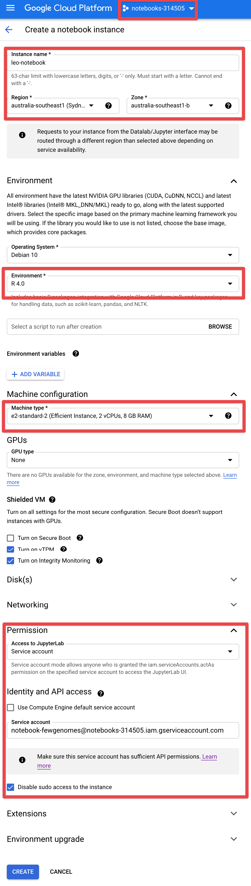
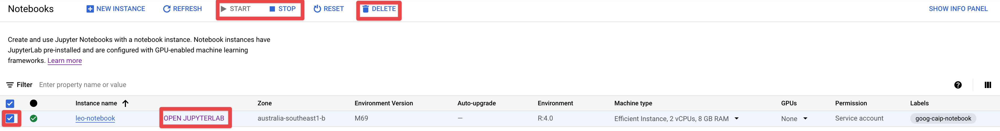

# Notebooks

JupyterLab notebooks can be extremely useful for exploring data and prototyping code in an interactive way. Running them directly on GCP VMs has two big advantages:

- avoiding any egress costs for downloading data from GCP, and
- avoiding the audit and security challenges that additional copies of the data (e.g. on laptops) cause.

The interactivity of notebooks is somewhat at odds with reproducibility and code reviews. To strike a balance, we grant the service accounts that are used to run the notebooks access to only a subset of buckets, namely the `test` and `temporary` buckets for a dataset (see the [storage policies](storage_policies) for context).

## Creating a new notebook

All notebooks should be created in the `notebooks-314505` GCP project. [Click here](https://console.cloud.google.com/vertex-ai/workbench/create-instance?project=notebooks-314505) to create a notebook instance.

Note the following settings in the screenshot below:

- _Region_: Make sure this is set to an Australian region, to avoid egress costs when accessing locally stored datasets.
- _Environment:_ The "R" environments include both Python and R notebook options.
- _Machine type:_ These are standard VM types. Pick the smallest configuration that's not sluggish to work with -- you can see the impact on price in the upper right corner.
- _Permission:_ If you pick "Single user only", only you will be able to access the instance. Otherwise you can share the instance with everybody who has access to the dataset that corresponds to the service account (see below).
- _Identity and API access:_ Make sure to unselect "Use Compute Engine default service account" here. Use a service account of the form `notebook-<dataset>@notebooks-314505.iam.gserviceaccount.com`. Replace `<dataset>` with `fewgenomes`, `tob-wgs`, etc. as required.



## Notebook management

As the notebook runs on a VM, the cost for keeping the notebook running is identical to keeping a VM running. It's therefore a good idea to stop notebooks when you're not using them and to delete them when they're no longer needed. Make sure to "check" the corresponding notebook instance on the left side in the [notebooks overview page](https://console.cloud.google.com/vertex-ai/notebooks/list/instances?project=notebooks-314505) to start / stop an instance, as shown in the screenshot below.



## Hail

To be able to access GCS paths (`gs://...`) directly in Hail, you need to install the [GCS Connector](https://github.com/GoogleCloudDataproc/hadoop-connectors/tree/master/gcs). Run the following after installing Hail:

```bash
cd $(find_spark_home.py)/jars && curl -O https://storage.googleapis.com/hadoop-lib/gcs/gcs-connector-hadoop2-2.0.1.jar && cd -
```
