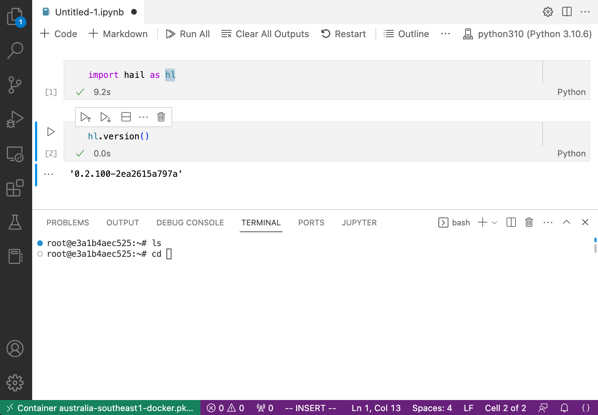

# Notebooks

JupyterLab notebooks can be extremely useful for exploring data and prototyping code in an interactive way. Running them directly on GCP VMs has two big advantages:

- avoiding any egress costs for downloading data from GCP, and
- avoiding the audit and security challenges that additional copies of the data (e.g. on laptops) cause.

The interactivity of notebooks is somewhat at odds with reproducibility and code reviews. To strike a balance, we grant the service accounts that are used to run the notebooks access to only a subset of buckets, namely the `test` and `temporary` buckets for a dataset (see the [storage policies](storage_policies/README.md) for context).

## Creating a new notebook

All notebooks should be created in the `notebooks-314505` GCP project. [Click here](https://console.cloud.google.com/vertex-ai/workbench/create-instance?project=notebooks-314505) to create a _User-Managed_ notebook instance. As of writing (July 2022), _Managed Notebooks_ are not available in Australia yet, but they'll be preferrable once they become available due to their automatic idle shutdown feature.

Note the following settings in the screenshot below:

- _Region_: Make sure this is set to an Australian region, to avoid egress costs when accessing locally stored datasets.
- _Environment:_ The "R" environments include both Python and R notebook options. To run Hail, select _Custom Container_ and enter `australia-southeast1-docker.pkg.dev/cpg-common/images/hail-gcp-notebook:0.2.126` (or a later version of the [hail-gcp-notebook image](https://github.com/populationgenomics/images/blob/main/images/hail-gcp-notebook/Dockerfile)) for the _Docker container image_ field.
- _Machine type:_ These are standard VM types. Pick the smallest configuration that's not sluggish to work with -- you can see the impact on price in the upper right corner.
- _Permission:_ If you pick "Single user only", only you will be able to access the instance. Otherwise you can share the instance with everybody who has access to the dataset that corresponds to the service account (see below).
- _Identity and API access:_ Make sure to unselect "Use Compute Engine default service account" here. Use a service account of the form `notebook-<dataset>@notebooks-314505.iam.gserviceaccount.com`. Replace `<dataset>` with `fewgenomes`, `tob-wgs`, etc. as required.


## Notebook management

As the notebook runs on a VM, the cost for keeping the notebook running is identical to keeping a VM running. It's therefore a good idea to stop notebooks when you're not using them and to delete them when they're no longer needed. Make sure to "check" the corresponding notebook instance on the left side in the [notebooks overview page](https://console.cloud.google.com/vertex-ai/notebooks/list/instances?project=notebooks-314505) to start / stop an instance, as shown in the screenshot below.


## Hail

Our [Hail notebook image](https://github.com/populationgenomics/images/blob/main/images/hail-gcp-notebook/Dockerfile) already has this set up, but in case you're using a different image: To be able to access GCS paths (`gs://...`) directly in Hail, you need to install the [GCS Connector](https://github.com/GoogleCloudDataproc/hadoop-connectors/tree/master/gcs). To install, run the following command:

```bash
curl https://raw.githubusercontent.com/broadinstitute/install-gcs-connector/master/install_gcs_connector.py | python3
```

Then run the following after installing Hail:

```bash
cd $(find_spark_home.py)/jars && curl -O https://storage.googleapis.com/hadoop-lib/gcs/gcs-connector-hadoop2-2.0.1.jar && cd -
```

## Using Visual Studio Code as a notebook IDE

Instead of the default Jupyter notebook IDE in the browser, you can also use Visual Studio Code on your local machine and connect to the notebook kernel running remotely.



There are a few steps to go through the first time you want to connect to a newly started notebook running on Google Cloud, but it's quick to reconnect afterwards.

The following instructions are a summary of [this guide](https://medium.com/google-cloud/choose-the-ide-you-want-and-develop-on-vertex-ai-workbench-part-i-94d19ca1d2ff):

1. Create a new notebook as explained [above](#creating-a-new-notebook).
1. Install the [Google Cloud Code](https://marketplace.visualstudio.com/items?itemName=GoogleCloudTools.cloudcode) extension.
1. In the status bar at the bottom, switch to the `notebooks-314505` project.
1. Select the _Cloud Code_ extension, navigate to `Compute Engine`, and connect to your notebook VM using SSH.
1. On the remote machine, enter `whoami` and note the result, which should look like `jane_doe_population`.
1. Run `sudo usermod -aG docker $USER` on the remote machine.
1. Disconnect (`exit`) and back on your local machine, run:

   ```sh
   gcloud --project=notebooks-314505 compute config-ssh
   ```

1. This should have populated your `~/.ssh/config` file. Open this file and find the `Host` associated with your notebook (based on its name). In that section, add the line `User=jane_doe_population`, copying the correct value from the previous step above.
1. Back in VS Code, run the _Remote-SSH: Connect to Host..._ command and select your notebook VM. This should open a new window.
1. In the new window, run the _Dev Containers: Attach to Running Container..._ command. Select the `/payload-container` entry. This will open up yet another window!
1. In the new window, attached to the container, install the _Python_ and _Jupyter_ extensions in the container.
1. Run the _Create: New Jupyter Notebook_ command.
1. In the upper right, select the `python310` kernel.
