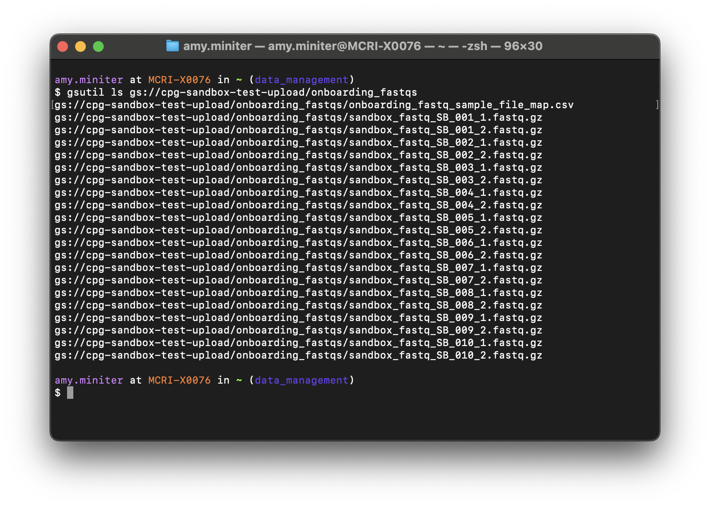
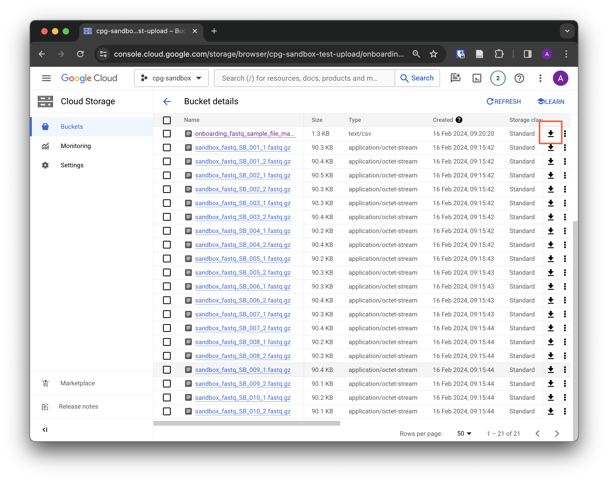
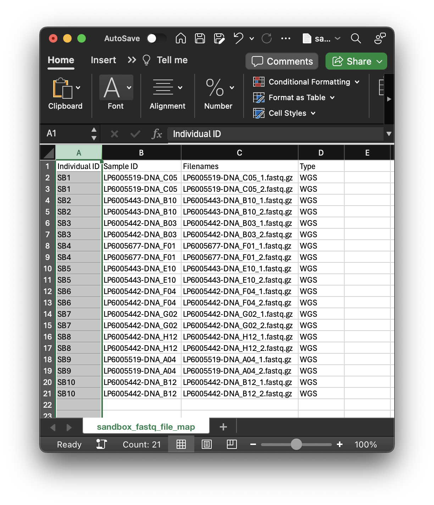
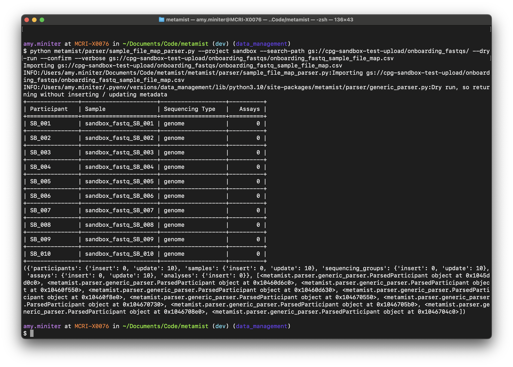
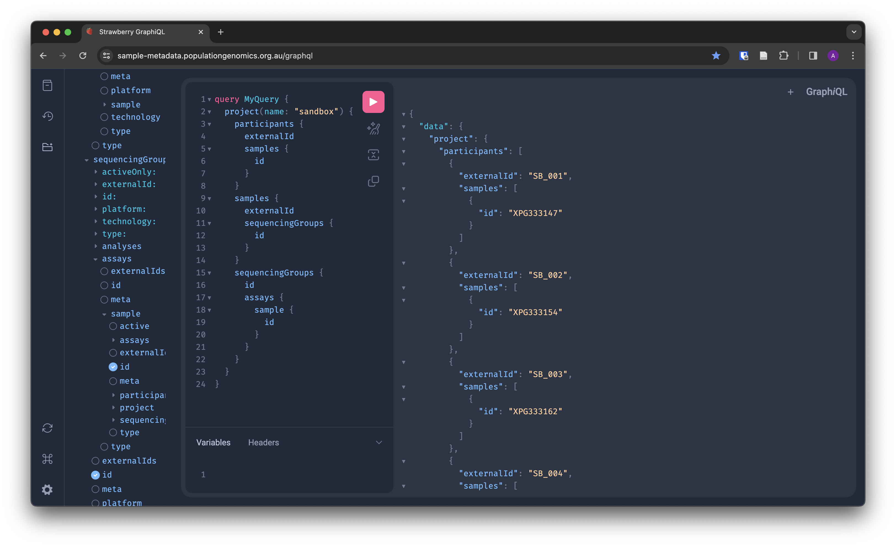

# Ingestion tutorial

## Overview

In this tutorial you will learn how to ingest genomics metadata into Metamist. This tutorial is intended for new starters or anyone that wishes to learn how the Centre for Population Genomics handles its metadata ingestion.

Basic knowledge of the following is assumed:

- Python
- Git (basic commands: clone, pull, push, commit, add)
- Metamist
- Descriptive metadata
- Unix
- Relational database design

By the end of the tutorial you will be able to:

- Locate CPG data stored in Google Cloud buckets
- Evaluate a metadata manifest file
- Ingest sample metadata into Metamist using existing CPG parsers
- Evaluate the outcome of Ingestion

## Before you start

### Requirements

- Access to your computer (with full admin/terminal privileges)
- Google Cloud SDK installed
- An Integrated development environment of your choice installed ([Visual Studio Code](https://code.visualstudio.com/download) is commonly used at the CPG)
- Access to your CPG Google account
- Membership in the [CPG GitHub organisation](https://github.com/populationgenomics)
- The [Metamist repository](https://github.com/populationgenomics/metamist) cloned to your machine
- Appropriate security permissions for the sandbox dataset assigned to you in [cpg-infrastructure-private](https://github.com/populationgenomics/cpg-infrastructure-private). Security groups are described in the [cpg-infrastructure-private README](https://github.com/populationgenomics/cpg-infrastructure-private/blob/main/README.md)
- Authentication completed for Google Cloud. Type the following two commands in your terminal and follow the prompts
    - `gcloud auth application-default login`
    - `gcloud auth login`

    More detailed authentication instructions are [provided here](https://github.com/populationgenomics/team-docs/blob/main/getting_started.md)

## How to ingest

1. Explore Google Cloud Storage

    CPG data are stored on Google Cloud. Metadata are stored on Metamist.

    Access the [Google Cloud console](https://console.cloud.google.com/storage/browser) and use the drop-down menu to select the dataset `cpg-sandbox`. This has been created as a sample project that we will use for this tutorial.

    You will see four types of storage buckets with the naming convention cpg-{dataset}-{storage type}. These bucket types and their associated storage restrictions are defined in [team-docs](https://github.com/populationgenomics/team-docs/blob/main/storage_policies/README.md). Take a moment to examine these buckets and to read about their associated storage restrictions.

    We will be using the bucket `cpg-sandbox-test-upload/onboarding_fastqs` for this tutorial in which a fictional collaborator has deposited data and a metadata manifest.

    

2. Examine the data stored in `cpg-sandbox-test-upload/onboarding_fastqs`

    Click on the link for the folder `cpg-sandbox-test-upload` and again on the link for folder `onboarding_fastqs`. You will now be located at `cpg-sandbox-test-upload/onboarding_fastqs`.

    Scan down the list of files in this folder in to check manually for any inconsistencies. Alternatively, use your terminal to list your files: `gsutil ls gs://cpg-sandbox-test-upload`.

    

    The data appear to be tidy and consistent. Note that files use the naming convention sandbox_fastq_SB_XXX_X.fastq.gz.

    The majority of files are compressed fastq files, which are used as raw input files for the analysis of genomic data. A summary of genomics file formats is [available here](https://docs.google.com/presentation/d/1TQPpDjjOqFy5gVb9Tu2Qqtus4JbnNEia-jWkDe6Sm0Q/edit#slide=id.gb6ec11b86e_0_65).

    A single file `onboarding_fastq_sample_file_map.csv` is a .csv file.

3. Examine your metadata to ensure that they are tidy and properly representative of the data

    Metadata has been provided for our tutorial by our kind fictional collaborator in the file `onboarding_fastq_sample_file_map.csv`. Metadata will not necessarily be colocated with your data and often collaborators will provide these via an alternative means such as email.

    Download this file to your computer. You can do this is by clicking the download symbol on the Google Console or by using your terminal: `gsutil cp gs://cpg-sandbox-test-upload/onboarding_fastqs/onboarding_fastq_sample_file_map.csv`. Using this command will download the file to your current working directory.

   

    Open this file using software of your choice. [Excel is ok for small-medium datasets](https://www.ibm.com/docs/en/planning-analytics/2.0.0?topic=issues-microsoft-excel-limits).

    Observe that there are 20 rows of data and 4 columns. There are two rows per individual. These each have identical values for `Individual ID` and `Sample ID` but each row has a distinct value for `Filenames`. File naming uses the following structure {Sample ID}{Integer}.fastq.gz. The file extensions .fastq and .gz indicate that these are zipped FASTQ files. All data have been derived from Whole Genome Sequencing, which is summarised in the `Type` column as ‘WGS’.

    The data are tidy and seem complete; there is no need to clean them.

    

    > ## As an aside
    >
    > Before continuing, let’s take a step back to understand what we are performing when we ingest metadata and the resulting structure of new metadata stored in metamist following this process. Reading this section is not required to complete the tutorial and you can skip it.
    >
    > ‘Ingestion’ can mean many different things according to the context. In this tutorial, we ingest the metadata in the .csv metadata manifest by generating new metadata records in metamist. This process does not include any ingestion of the data themselves - these remain in the storage bucket. The end result of this process is that we can use the new metadata in Metamist as a record of the data that we have on hand, to perform analyses, to understand the history of our interaction with these data and to point to the bucket location of these data.
    >
    > We will be generating metadata in four different tables in metamist from each row in the metadata manifest file. We will create
        >
        > A new participant in the `Participant` table (csv column: `Individual ID`)
        > A new sample in the `Sample` table linked to the relevant participant (csv column: `Sample ID`)
        > A new assay in the `Assay` table linked to the relevant sample and sequencing group (csv column: `Filenames`)
        > A new sequencing group in the `Sequencing Group` table that links related assays together
    >
    > The image below captures the relationship between the different elements of the metadata that we will be ingesting in Metamist.
    >
    > 
    >
    > An up-to-date Metamist schema is available in the metamist repository. Not all fields in the metadata schema are mandatory and metadata is ingested differently for each table.
    >
    > _We are adding new metadata to Metamist in this tutorial. When metadata already exist in Metamist, the process is different and care must be taken to avoid overwriting records._
    >

4. Find an existing CPG parser to ingest your metadata

    Parsing first checks to see if the metadata being ingested conform to an anticipated structure. Then parsing will transform the metadata listed in the metadata manifest to populate the required tables in Metamist.

    Ingestion is normally performed at the CPG using existing software modules called Parsers. These are written in Python and are maintained jointly by Software and Analysis teams. Parsers are located in `metamist/parser`. Parsers are designed using [class-based inheritance](https://en.wikipedia.org/wiki/Inheritance_(object-oriented_programming)), which adapts generic parsers to custom use cases like different datasets.

    We will use the parser `metamist/parser/sample_file_map_parser.py` for this tutorial, which is located in the Metamist repository. Take a moment to read the comments at the head of the file, but know that there’s no need to understand this exhaustively.

5. Ensure that the metadata manifest is accessible to the parser

    If the metadata manifest is co-located with your data in the Google Clouds storage bucket, you do not need to take any action. This will be accessible to the parser.

    If your collaborator has provided the metadata manifest separately to the data, please download the manifest to your local machine and add it to a new folder in your local metamist repository. Add this folder to your .gitignore file to ensure that this change is not pushed to the remote repository.

6. Compose the command to run the parser script

    The parser is written with the [Python Click module](https://click.palletsprojects.com/en/8.1.x/), which allows us to run the parser script with command line arguments that tweak the command, mostly by changing defaults. Details on these arguments are listed in `metamist/metamist/parser/sample_file_map_parser.py`. Arguments are recognisable by the @click annotator.

    You will need to provide at least the following information when composing your command:
    python {path to selected parser module} --project {project name} --search-path {path to search for files in google cloud storage} {path to metadata manifest}

    For this example, using the metadata manifest co-located with the data, we will use the following command:

    `python metamist/parser/sample_file_map_parser.py --project sandbox --search-path gs://cpg-sandbox-test-upload/onboarding_fastqs/ gs://cpg-sandbox-test-upload/onboarding_fastqs/onboarding_fastq_sample_file_map.csv`

    We will modify our command with the following flags:

    - --dry-run (prepares the run without committing it.)
    - --confirm (before updating the server, confirms with the user)
    - --verbose (gives very detailed textual output surrounding your command)

    `python metamist/parser/sample_file_map_parser.py --project sandbox --search-path gs://cpg-sandbox-test-upload/onboarding_fastqs/ --dry-run --confirm --verbose gs://cpg-sandbox-test-upload/onboarding_fastqs/onboarding_fastq_sample_file_map.csv`

7. Run the parser script through your terminal

    Use Visual Studio Code or your preferred IDE to perform this step and ensure that you have the Metamist repository opened as your project. Following instructions are provided for Visual Studio Code.

    Open a new terminal by clicking the Terminal button in your menu bar and the ‘New Terminal’ option.

    Due to the way that the paths have been defined in our command, ensure that you are in the correct directory first before execution. Ensure that you are at the ‘top level’ of the metamist repository by typing pwd in your terminal and hit enter. You should see a file path printed similar to the following:

        /Users/{your name}/{storage location}...{/optional subfolders}/metamist

    Paste the command composed in your terminal in step 6 and hit enter.

    ⚠️ If you receive an error message that states that you have not configured your default project, please try one of the two following commands to set sandbox as your default project:
    - `gcloud auth application-default set-quota-project cpg-sandbox`
    - `gcloud config set project cpg-sandbox`

8. Verify the outcome of your command in your terminal
    If the  `--verbose` or `--confirm` flags have been provided, you will see descriptive text and a tabular representation in your terminal that summarises what has been ingested. Check that this corresponds to your metadata manifest file.

    

    Read the descriptive text underneath the table to check which tables and ensure that you have the required number of inserts, again according to your metadata manifest file. We can see that there are 10 insertions per table, which corresponds to the 10 participants included in the original file.

    {'participants': {'insert': 10, 'update': 0}, 'samples': {'insert': 10, 'update': 0}, 'sequencing_groups': {'insert': 10, 'update': 0}, 'assays': {'insert': 10, 'update': 0}, 'analyses': {'insert': 0}}

    The ingestion seems to have gone well but we also need to verify in Metamist itself.

9. Verify the outcome of your command using GraphiQL

    Browse metamist to view the metadata that have just been ingested. Using [Strawberry GraphiQL](https://sample-metadata.populationgenomics.org.au/graphql), copy the following query and press the pink 'Run' button.
    <pre>
    query MyQuery {
        project(name: "sandbox") {
            participants {
                externalId
                samples {
                    id
            }
            }
            samples {
                externalId
                sequencingGroups {
                    id
            }
            }
            sequencingGroups {
                id
                assays {
                    sample {
                    id
                    }
                }
            }
        }
    }
    </pre>

     

    We only ingested metadata for 10 participants, so we can examine query results manually.

    Examine metadata returned under the `participants` header in the first part of the query. Observe that there are 10 results with an `external ID` matching the IDs listed in the metadata manifest.

    Examine metadata returned under `samples` header. Observe that there are 10 results with an `external ID` matching the file name listed in the metadata manifest.

    Examine metadata returned under the `sequencingGroups` header. Observe that there are, again, 10 results. Each contains an ID, which will match one of the 10 results returned under `samples/sequencingGroups/id`. Note that each contains a results under an `assays` header. Each of the 10 assays is associated with a single `sample ID`, which match the `sample id` that we retrieved for the participant.

    These results match our expectations. Your ingestion was successful! Congratulations!

## Summary

In this tutorial, you examined data and metadata provided to you by a fictional collaborator. You ingested these data into a production instance of Metamist using  theparser `sample_file_map.py` and you verified that this ingestion has been executed correctly.

The activities that you completed are a basic stepping stone for ingestion practices across the CPG. Now you will be able to ingest data on behalf of your team, which will enable analysis and other downstream uses.

## Next steps

- How to delete/modify data in metamist
- Ingest a metadata file when records already exist in metamist
