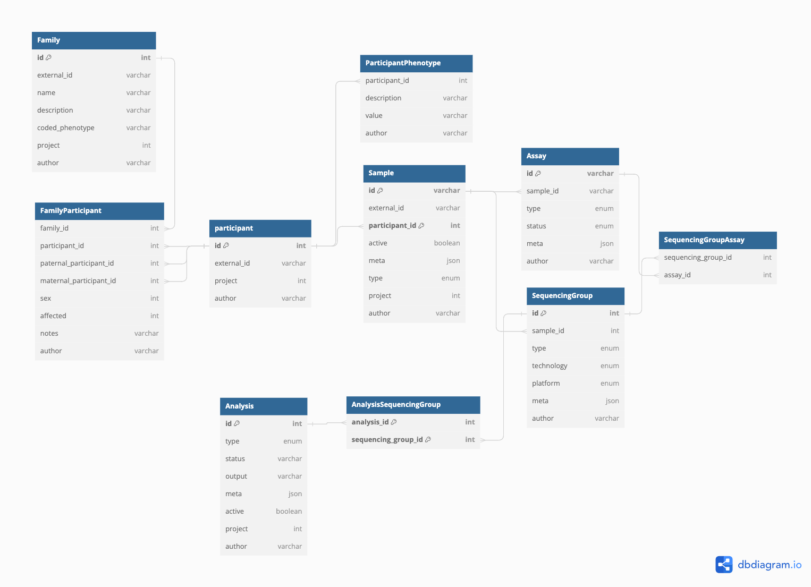
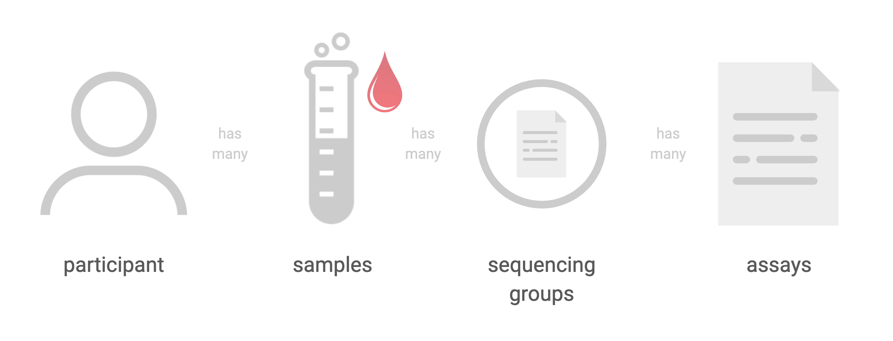
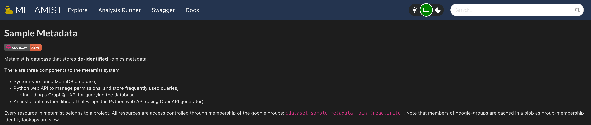
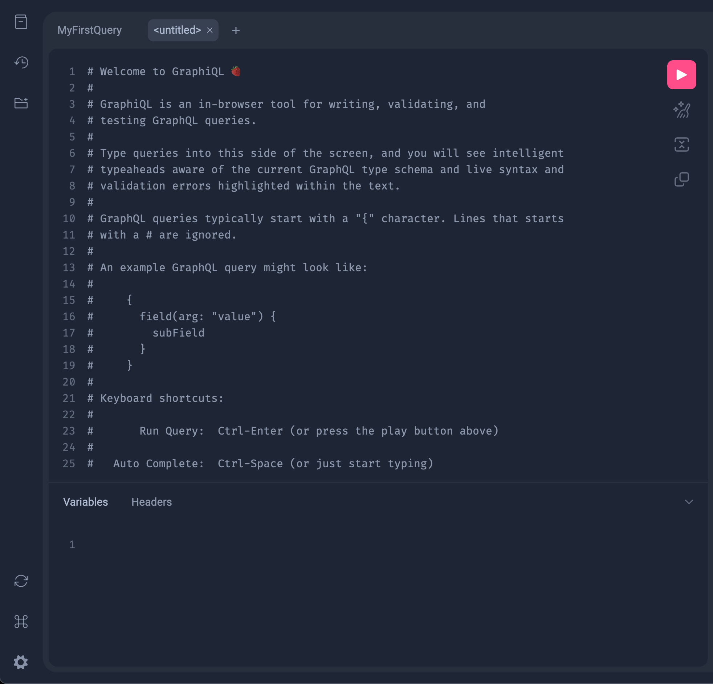
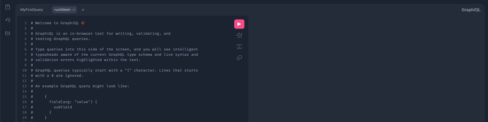
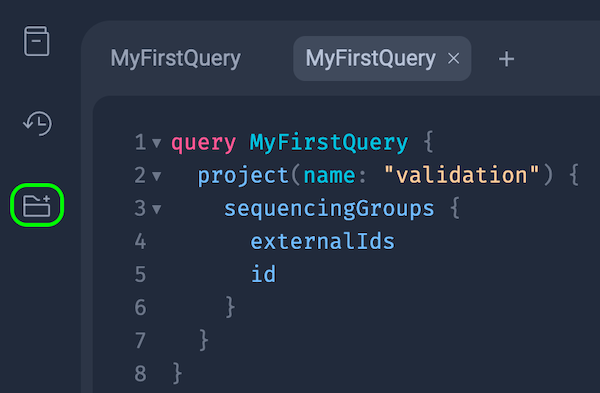

# Introduction

The aim of the following exercises is to allow you to get first hand experience working with the CPG codebase, the tools used to conduct analyses, as well as the supporting infrastructure that enables the management and utilisation of data.

# 1. Query metamist for `.fastq` files

The first step in understanding Metamist is to understand how to query the database so that we can get the necessary information on our samples. Metamist is used to track file locations, participant id's, status' of samples (i.e. the location of the files on Google Cloud, whether the the .fastq files have been converted to .cram, whether there is a .vcf file available, and whether the sample has been joint called with other samples). Metamist is CPG's way of keeping track of everything. 

Metamist is built on a GraphQL infrastructure. GraphQL is a query language for APIs that provides a more efficient and flexible alternative to traditional RESTful APIs. It allows clients to request exactly the data they need, and nothing more, by specifying the structure of the response in the query itself. This reduces over-fetching and under-fetching of data. 

**Note:** In your everyday use of Metamist, many of the interactions happen seamlessly in the background, shielded from the user. Nevertheless, having a profound understanding of Metamist's inner workings is crucial because it forms the core of CPG. When operating at the pipeline level, there's usually no need for manual query construction; the pipeline handles this complexity for users. However, possessing this knowledge remains vital, particularly for those wishing to delve deeply into the specifics of individual participants or components.

Before diving in to Metamist, it's important to understand the structure of the data. The following diagram shows the relationship between the different entities in the CPG database.



The core concept of Metamist is a `SequencingGroup`. 

- A `SequencingGroup` is essentially a set of reads that are output of one `Assay`. Within a `SequencingGroup`, you'll find one or more `Assays`. Each `Assay` represents a collection of files generated from a single sequencing run. These `Assays`, in turn, consist of one or more `Reads`. A `Read` is essentially a single file containing the raw reads from a specific lane in the sequencing process.
  - At this point an `Assay` is either genome or exome sequencing but could refer to genotyping arrays/proteomics/RNA assays etc. in the future.
- Importantly, a `SequencingGroup` is always tied to a single participant and never spans across multiple patient samples. It's a way to categorise the type of sequencing conducted, like genome or exome sequencing. For example, if an individual undergoes both genome and exome sequencing, you'll have two distinct `SequencingGroups`, each corresponding to one of these sequencing types.
- When we trace back from a `SequencingGroup` to a `Participant`, we see that participants contribute `Samples` linked by a unique `participant_id`. A `Participant` essentially represents an individual who has provided samples for genetic analysis. It's possible for a single `Participant` to have multiple samples, which enables us to gather comprehensive genetic insights from the same individual.
- Furthermore, tracing back from a `SequencingGroup` to a `Family`, we discover that a `Family` comprises participants who share genetic relationships. External collaborators use external IDs to refer to families, while our internal system assigns both family and participant IDs to facilitate efficient tracking.
- ***Summary:*** `Samples` are linked by a unique `participant_id`. The physical sample taken from the participant at a time and place. `Assays` are performed on this sample to produce `reads`, these collectioms of fastq files (i.e. the `reads`) are what are referred to as a `SequencingGroup`. If we were to go back and re-run an assay on that sample, this would produce a new `SequencingGroup`
  


Let's first work with Metamist and GraphQL using the GUI. Navigate to https://sample-metadata.populationgenomics.org.au/ to see the homepage of CPG's Metamist implementation. 




### GraphQL

QL stands for 'Query Language,' signifying a specific syntax designed for querying servers or performing data mutations. Unlike RESTful APIs, which typically feature multiple endpoints for different resources, each with its set of endpoints for various HTTP methods like GET, POST, DELETE, and PUT, GraphQL streamlines this with a single endpoint. This single endpoint efficiently handles queries and mutations, reducing the number of required server requests.

To send a query to a GraphQL server, you use GraphQL syntax. This syntax differs from the structure used in RESTful API requests. A GraphQL query takes the form of:

```graphql
query MyFirstQuery { # can save query for future use
  project(name: "<example-project-name>") {
    sequencingGroups {
      externalIds
      id
    }
  }
}
```
Breaking down the above query:
- `query MyFirstQuery` is the name of the query. This is optional, but it's good practice to name your queries.
  - Project with the name "example-project-name"
      - Inside this project, retrieve information about:
          - `sequencingGroups`
              - Within each `sequencingGroup`, fetch data about:
                  - external ID's and the ID of the `sequencingGroup`

This is great because it means that we can get all the information we need in a single request. We don't need to make multiple requests to get the information we need, and there is no under-fetching or over-fetching of data.

Let's see this request in action. The single GraphQL endpoint for CPG's Metamist is https://sample-metadata.populationgenomics.org.au/graphql. This is the endpoint that we'll be sending our queries to. Navigate to this endpoint in your browser. You should see the following:



As the homepage says this is an interface for building your GraphQL queries. Let's try sending the query we wrote above. Copy and paste the query into the left hand side of the screen and press the play button in the top right hand corner. You should see the following:


|  |  |
| - | - |
| As an aid to help build queries, GraphiQL provides a user interface that allows you to explore the schema of the GraphQL server. The schema is essentially a description of the data that is available on the server. You can see the schema by clicking on the 'GraphiQL Explorer' button on the left hand side. You should see the following: |  | 

This user interface is great to building and testing your queries that can eventually be used in code.

###  Task:
- Using the GraphiQL interface, within `project` 'Example-project-ID' write a query that returns the metadata (`meta`) of the `assays` as well as the `externalID` of the `sample` corresponding to the `SequencingGroup` with the `id` of `<example-CPGID>`. 

<details>
  <summary>Click to see answer</summary>
  
  ```graphql
  query MyQuery {
    project(name: "validation-test") {
      sequencingGroups(id: {eq: "<example-CPGID>"}) {
        assays {
          meta
        }
        sample {
          externalId
        }
      }
    }
  }
  ```
</details>  

Next, let's try sending this query using Python. We'll be using the `sample-metadata` Python package to do this. This package is a wrapper around the `requests` package that makes it easier to send GraphQL queries to the Metamist server.

You will first need to install `metamist` using `pip`. You can do this by running the following command in your terminal:  
```python
pip install metamist==6.2.0
```

Now that you have `metamist` installed, let's try sending the query we wrote above using Python. Create a new Python file called `query_metamist.py` and copy and paste the above code into it.

```python
from metamist.graphql import gql, query
import json

_query = gql(
    """
query ($project: String! $sequencingGroupID: String!) {
  project(name: $project) {
    sequencingGroups(id: {eq: $sequencingGroupID}) {
      assays {
        meta
      }
      sample {
        externalId
      }
    }
  }
}
"""
)
# here we're just printing the output of the query in a nice format
variables = {'project': '<project-ID', 'sequencingGroupID': '<example-CPGID>'}
print(json.dumps(query(_query, variables=variables), indent=4))
```
Notice how we don't need to specify the project or sequencingGroup ID's in the query itself. We can pass the variables to the query using the `variables` argument in the `query` function. This is a good way to avoid hard coding variables into your query.

Running the above script in the terminal will print the output of the query in a nice readable json format. You should see the following:

```json
Once samples/sequencingGroups are finalised, place output here
```

In the above output we can see that for `SequencingGroup` `<example-COGID>` there is a set of reads (forward and reverse) that have been uploaded to Google Cloud Storage. We can also see that the `sequencing_type` is `exome` and the `sequencing_technology` is `short-read`. We can also see that the `externalId` of the `sample` is `<example-externalID>`.
At a pipeline level, there's very little need to actually build a query by hand, the pipeline abstracts this away from the user. but it is still essential knowledge, especially if one wants to take a deep dive into a specific participant.


# 2. Build and publish a Docker image  
At CPG each tool we use is packaged into a Docker image. This ensures that everyone is using the same version of the tool. It also allows us to easily run the tool on the cloud using Hail Batch.
FastQE is a fun tool that mimics the output of FastQC (a more 'official' bioinformatic tool) but instead represents the quality scores with emojis. Clearly, FastQE is not intended for use in a production environment. However, it serves as an illustrative example of a tool currently missing from our library. To incorporate it, we need to construct a corresponding Docker image.

Have a go at writing a Dockerfile for FastQE. Have a look at the [images](https://github.com/populationgenomics/images) repo to see how other images are built. **Hint:** You can use the `python:3.10-slim` image as a base image and will install FastQE version 0.3.1 using `pip`.

<details>
  <summary>Click to see answer</summary>

```Docker
FROM python:3.10-slim

ARG VERSION=${VERSION:-0.3.1}
RUN pip install fastqe==${VERSION}
```
</details>

CLI command to build the image:

```bash
docker build -t fastqe_image:1.0.0 . --platform=linux/amd64
```

Note that we need to specify the platform as `linux/amd64` because we are building the image on a Mac. If you are building the image on a Linux machine, you can omit the `--platform` flag.

# 3. Write a script to run FastQE

The basic outline of our script is going to be:
1. Query Metamist for the `SequencingGroup` ID's of the samples we want to run FastQE on
2. For each `SequencingGroup` ID:
    - Query Metamist for the location of the fastq files
    - Build a dictionary mapping the `SequencingGroup` ID to the location of the fastq files
3. Build a Hail Batch command that uses the FastQE image
    - Run FastQE on the fastq files

### Task: Write the query to get the `SequencingGroup` ID's of the samples we want to run FastQE on
- Tip: first import `gql` and `query` from `metamist.graphql`. Then write the query as a global variable and wrap it in a `gql()` call. Use the GraphQL interface to practice the query before writing it in Python.

<summary>
<details>
  <summary>Click to see answer</summary>

```python
from metamist.graphql import gql, query

SG_ASSAY_QUERY = gql(
    """
    query ($project: String!) {
        sequencingGroups(project: {eq: $project}) {
            id
            assays {
                id
                meta
            }
        }
    }
    """
)
```
</details>

The next step is to iterate through the response of the above query and create a mapping of `SequencingGroup` ID's to the locations of the fastq files.

### Task: Write the function to map the `SequencingGroup` ID's to the locations of the fastq files

- This will be a simple for loop that iterates through the response of the above query and creates a dictionary mapping the `SequencingGroup` ID's to the locations of the fastq files.
<details>
  <summary>Click to see answer</summary>

```python
def get_assays(project: str) -> list[str]:
    """
    Queries the specified project for sequencing groups and assays, and returns a dictionary mapping sequencing group IDs to read locations.

    Args:
        project (str): The name of the project to query.

    Returns:
        dict: A dictionary where each key is a sequencing group ID and each value is a list of read locations for that sequencing group.
    """
    sg_assay_map = {}

    # Use the query template above to query the sequencing groups and assays
    query_response = query(SG_ASSAY_QUERY, {'project': project})
    for sg in query_response['sequencingGroups']:
        sg_id = sg['id']
        for assay in sg['assays']:
            assay_meta = assay['meta']
            reads = assay_meta.get('reads')
            if reads is None:
                continue
            else:
                read_locations = [read['location'] for read in reads]
            sg_assay_map[sg_id] = read_locations

    return sg_assay_map
```
</details>

### Task: Write the Hail Batch command to run FastQE on the fastq files
- This step brings it all together. There is already an exercise in the `team-docs` repo that walks through how to run a Hail Batch command. Have a look at the [Analysis-runner tutorial](https://github.com/populationgenomics/team-docs/tree/main/exercise-analysis-runner#the-batch-to-run) to see how to write a Hail Batch command.
- You can also see exapmles of Hail Batch commands in the `production-pipelines` repo [here](https://github.com/populationgenomics/production-pipelines/blob/main/cpg_workflows/jobs/fastqc.py). This is a good example to look at because it is very similar to what we are trying to do here. The only difference is that we are using a different image and running a different tool (FastQC instead of FastQE).

<details>
<summary>Click to reveal Batch command</summary>

```python
def main(project: str):
    # region: metadata queries
    # This section is all executed prior to the workflow being scheduled,
    # so we have access to all variables

    # Metamist query for files
    file_dict = get_assays(project)
    # endregion

    # region: Batch time
    b = get_batch('Schedule some worker tasks')
    for sg, files in file_dict.items():
        # check that we have 2 files (assuming FQ, rather than BAM)
        assert len(files) == 2

        # Create a job for each sample
        j = b.new_job(f'Job for {sg}')

        # Set the docker image to use in this job
        # this pulls the image path from the portion of the config
        # populated by the images repository
        j.image(image_path('fastqe'))

        # read data into the batch tmp resource location
        file_1 = b.read_input(files[0])
        file_2 = b.read_input(files[1])

        # Set the command to run
        # batch.read_input will create a new path like /io/batch/75264c/CPGAAAA_1.fq.gz
        # accessible from inside the job container, and unique to this batch/job
        j.command(
            f'echo "Hello world, I am a job for {sg}!, using {file_1} and {file_2}"'
            f'I\'m also creating an output file at {j.output}'
            f'echo "Some outputs" > {j.output}'
        )

        # read the output out into GCP
        # The helper method output_path() will create a new path based on the current project,
        # test/main, and the output prefix provided to analysis_runner
        # -o my_output
        # --dataset my-dataset
        # --access_level test
        # output_path('this_file.txt')
        # -> gs://cpg-my-dataset-test/my_output/this_file.txt
        b.write_output(j.output, output_path(f'/{sg}.txt'))
    # endregion
```
</details>


Putting it all together, our python script should look like this:

```python
from argparse import ArgumentParser

from metamist.graphql import gql, query
from collections import defaultdict
from cpg_utils.config import get_config
from cpg_utils.hail_batch import image_path, output_path

from cpg_workflows.batch import get_batch  # defunct?
from cpg_utils.hail_batch import get_batch

# PROJECT = get_config()["workflow"]["dataset"]
PROJECT = "bioheart-test"

SG_ASSAY_QUERY = gql(
    """
    query ($project: String!) {
        sequencingGroups(project: {eq: $project}) {
            id
            assays {
                id
                meta
            }
        }
    }
    """
)


def get_assays(project: str) -> list[str]:
    """
    Queries the specified project for sequencing groups and assays, and returns a dictionary mapping sequencing group IDs to read locations.

    Args:
        project (str): The name of the project to query.

    Returns:
        dict: A dictionary where each key is a sequencing group ID and each value is a list of read locations for that sequencing group.
    """
    sg_assay_map = {}

    # Use the query template above to query the sequencing groups and assays
    query_response = query(SG_ASSAY_QUERY, {'project': project})
    for sg in query_response['sequencingGroups']:
        sg_id = sg['id']
        for assay in sg['assays']:
            assay_meta = assay['meta']
            reads = assay_meta.get('reads')
            if reads is None:
                continue
            else:
                read_locations = [read['location'] for read in reads]
            sg_assay_map[sg_id] = read_locations

    return sg_assay_map


def main(project: str):
    # region: metadata queries
    # This section is all executed prior to the workflow being scheduled,
    # so we have access to all variables

    # Metamist query for files
    file_dict = get_assays(project)
    # endregion

    # region: Batch time
    b = get_batch('Schedule some worker tasks')
    for sg, files in file_dict.items():
        # check that we have 2 files (assuming FQ, rather than BAM)
        assert len(files) == 2

        # Create a job for each sample
        j = b.new_job(f'Job for {sg}')

        # Set the docker image to use in this job
        # this pulls the image path from the portion of the config
        # populated by the images repository
        j.image(image_path('fastqe'))

        # read data into the batch tmp resource location
        file_1 = b.read_input(files[0])
        file_2 = b.read_input(files[1])

        # Set the command to run
        # batch.read_input will create a new path like /io/batch/75264c/CPGAAAA_1.fq.gz
        # accessible from inside the job container, and unique to this batch/job
        j.command(
            f'echo "Hello world, I am a job for {sg}!, using {file_1} and {file_2}"'
            f'I\'m also creating an output file at {j.output}'
            f'echo "Some outputs" > {j.output}'
        )

        # read the output out into GCP
        # The helper method output_path() will create a new path based on the current project,
        # test/main, and the output prefix provided to analysis_runner
        # -o my_output
        # --dataset my-dataset
        # --access_level test
        # output_path('this_file.txt')
        # -> gs://cpg-my-dataset-test/my_output/this_file.txt
        b.write_output(j.output, output_path(f'/{sg}.txt'))
    # endregion


if __name__ == '__main__':
    # optional direct input of samples
    parser = ArgumentParser(description='Hail Batch FastQE')
    parser.add_argument('-p', nargs='+', help='Project name', required=True)
    args, fails = parser.parse_known_args()

    if fails:
        raise ValueError(f'Failed to parse arguments: {fails}')
    main(samples=args.p)
```


# 4. Run the jobs through analysis runner

For a run through on how to submit jobs using analysis runner, please see the [analysis runner tutorial](https://github.com/populationgenomics/team-docs/tree/main/exercise-analysis-runner) in the team-docs repo.

The `--image` flag in the analysis-runner command line is specifically designed to specify an alternative image to the standard analysis-runner driver image. This alternative image must contain all necessary dependencies to handle authentication, create Hail batches, and perform other required tasks.

In the context of our FastQE example, we would not use this `--image` flag. Instead, we would execute a script within the standard driver image that initiates a new batch. Within this batch, one of the jobs would employ the FastQE image we previously built. The process of localising and delocalising input and output files would be managed directly by Hail, not by the FastQE image.

```bash
analysis-runner \
    --dataset <dataset> \
    --description "test Run FastQE" \
    --access-level test \
    --output-dir <directory-within-bucket> \
    script_to_run.py with arguments
```


# 5. Pull the output and visualise (presumably html)

To be completed once the above steps are completed.