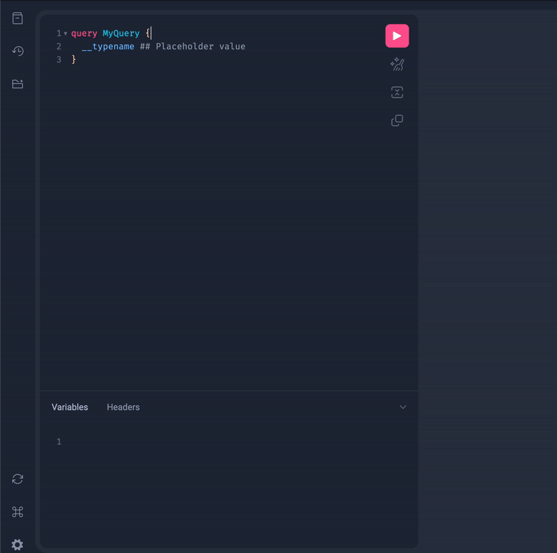

# Introduction

The aim of the following exercise is to allow you to get first hand experience working with the CPG codebase, the tools used to conduct analyses, as well as the supporting infrastructure that enables the management and utilisation of data.

## Table of Contents

1. [Query metamist for `.fastq` files](#1-query-metamist-for-fastq-files)
2. [Build and publish a Docker image](#2-build-and-publish-a-docker-image)
3. [Write a script to run FastQE](#3-write-a-script-to-run-fastqe)
4. [Update Metamist with the location of the output files](#4-update-metamist-with-the-location-of-the-output-files)
5. [Run the jobs through analysis runner](#5-run-the-jobs-through-analysis-runner)
6. [Pull the output and visualise](#6-pull-the-output-and-visualise)

## 1. Query metamist for `.fastq` files

The first step in understanding Metamist is to understand how to query the database so that we can get the necessary information on our samples. Metamist is used to track file locations, participant IDs, statuses of samples (i.e. the location of the files on Google Cloud, whether the the `.fastq` files have been aligned to form`.cram`s, whether there is a `.vcf` file available, and whether the sample has been joint called with other samples). Metamist is CPG's way of keeping track of everything.

Metamist is built on a GraphQL infrastructure. GraphQL is a query language for APIs that provides a more efficient and flexible alternative to traditional RESTful APIs. It allows clients to request exactly the data they need, and nothing more, by specifying the structure of the response in the query itself. This reduces over-fetching and under-fetching of data.

**Note:** In your everyday use of Metamist, many of the interactions happen seamlessly in the background, shielded from the user. Nevertheless, having a profound understanding of Metamist's inner workings is crucial because it forms the core of CPG. When operating at the pipeline level, there's usually no need for manual query construction; the pipeline handles this complexity for users. However, possessing this knowledge remains vital, particularly for those wishing to delve deeply into the specifics of individual participants or components.

Before diving in to Metamist, it's important to understand the structure of the data. The following diagram shows the relationship between the different entities in the CPG database.

<div style="text-align: center;">
    
</div>

The core concept of Metamist is a `SequencingGroup`.

- A `Participant` is an individual who has provided samples for genetic analysis. Each `Participant` is linked by a unique `participant_id` and can have multiple Samples. A Sample is the physical sample taken from the participant at a time and place.
- `Samples` are used to generate `Assays`. Each `Assay` represents a collection of files generated from a single sequencing run. These `Assays`, in turn, consist of one or more `Reads` (real files). A `Read` is essentially a single file containing the raw reads from a specific lane in the sequencing process. At this point an `Assay` is either genome or exome sequencing but could refer to genotyping arrays/proteomics/RNA assays etc. in the future.
- A fixed set of `Assays` form a `SequencingGroup`. A `SequencingGroup` is a virtual entity (A "virtual file" in this context refers to an entity that is represented in the database but doesn't have a corresponding physical file stored in the file system or cloud storage.) that represents a set of reads output from one or more `Assays`. For example, each `.cram` (alignment) file is linked 1:1 with `SequencingGroup`. Importantly, a `SequencingGroup` is always tied to a single participant and never spans across multiple patient samples. It's a way to categorise the type of sequencing conducted, like genome or exome sequencing. For example, if an individual undergoes both genome and exome sequencing, you'll have two distinct `SequencingGroups`, each corresponding to one of these sequencing types.
- Furthermore, tracing back from a `SequencingGroup` to a `Family`, we discover that a `Family` comprises participants who share genetic relationships. External collaborators use external IDs to refer to families, while our internal system assigns both family and participant IDs to facilitate efficient tracking.
- **Summary**: `Participants` can have many `Samples`. `Samples` are used to generate `Assays`. A fixed set of `Assays` form a `SequencingGroup`. If we were to go back and re-run an assay on that sample, this would produce a new `SequencingGroup`.

<div style="text-align: center;">
    
</div>

Let's first work with Metamist and GraphQL using the GUI. Navigate to <https://sample-metadata.populationgenomics.org.au/> to see the homepage of CPG's Metamist implementation.

<div style="text-align: center;">
    
</div>

(Also accessible using https://popgen.rocks/metamist 😎)

### GraphQL

GraphQL, standing for 'Query Language,' signifies a specific syntax designed for querying servers or performing data mutations. Unlike RESTful APIs, which typically feature multiple endpoints for different resources, GraphQL uses a single endpoint. This single endpoint efficiently handles queries and mutations, reducing the number of required server requests. However, the key feature of GraphQL, particularly for our purposes, is its ability to query for and connect entities across multiple database tables without the need for explicit `join` statements. This feature allows us to consolidate what would typically be 3 or 4 separate `GET` queries in a RESTful API into a single GraphQL query, which returns the data in the appropriate hierarchical structure. It's important to note that while GraphQL has these capabilities, our current `POST`/`PATCH` operations are not using GraphQL but are instead using the previous endpoints.

See some documentation here: 
- https://graphql.org/learn/queries/#variables
- https://graphql.org/learn/queries/#fields
- https://graphql.org/learn/queries/#arguments
- And plenty more

To send a query to a GraphQL server, you use GraphQL syntax. This syntax differs from the structure used in RESTful API requests. A GraphQL query takes the form of:

```graphql
query MyFirstQuery { # can save query for future use
  project(name: "sandbox") {
    sequencingGroups {
      externalIds
      id
    }
  }
}
```

Breaking down the above query:

- `query MyFirstQuery` is the name of the query. This is optional, but it's good practice to name your queries.
  - Search for the `Project` with the `name` "sandbox"
      - Inside this project, retrieve information about `sequencingGroups`
      - For each `sequencingGroup`, fetch:
          - external IDs for each `sequencingGroup`
- internal ID of the `sequencingGroup`

This is great because it means that we can get all the information we need in a single request. We don't need to make multiple requests to get the information we need, and there is no under-fetching or over-fetching of data.

Let's see this request in action. The single GraphQL endpoint for CPG's Metamist is <https://sample-metadata.populationgenomics.org.au/graphql>. This is the endpoint that we'll be sending our queries to. Navigate to this endpoint in your browser. You should see the following:

<div style="text-align: center;">
    
</div>

As the homepage says this is an interface for building your GraphQL queries. Let's try sending the query we wrote above. Copy and paste the query into the left hand side of the screen and press the play button in the top right hand corner. You should see the following (note: the `SequencingGroup` id's may be different for you as the bucket may have been cleared and re-populated since this was written):

<div style="text-align: center;">
    
</div>

As an aid to help build queries, GraphiQL provides a user interface that allows you to explore the schema of the GraphQL server. The schema is essentially a description of the data that is available on the server. You can see the schema by clicking on the 'GraphiQL Explorer' button on the left hand side. This user interface is great to building and testing your queries that can eventually be used in code.

<div style="text-align: center;">
    
</div>
<br>


### Task

- Using the GraphiQL interface, write a query that returns the metadata (`meta`) of the `assays` as well as the `externalID` of the `sample` corresponding to the `SequencingGroup` with the `id` of `CPG327239` within the "sandbox-test" `project`.

<br>
<br>

<details>
  <summary>Click to see answer</summary>

  ```graphql
  query MyQuery {
    project(name: "sandbox-test") {
      sequencingGroups(id: {eq: "CPG327239"}) {
        assays {
          meta
        }
        sample {
          externalId
        }
      }
    }
  }
  ```

</details>
<br>

Next, let's try executing this query using Python. We'll be using the metamist Python package to do this. Metamist is more than just a wrapper around the requests package; it's the CPG's metadata database. The installable Python package includes both the database server components and the API clients used to query this data. Metamist's GraphQL features are used to construct queries to the Metamist server and parse the responses.

You will first need to install `metamist` using `pip`. You can do this by running the following command in your terminal:

```bash
pip install metamist==2.43.3
```

Now that you have `metamist` installed, let's try sending the query we wrote above using Python. Create a new Python file called `query_metamist.py` and copy and paste the above code into it.

```python

from metamist.graphql import gql, query

import json

_query = gql(
    """
query ($project: String! $sequencingGroupID: String!) {
  project(name: $project) {
    sequencingGroups(id: {eq: $sequencingGroupID}) {
      assays {
        meta
      }
      sample {
        externalId
      }
    }
  }
}
"""
)

# here we're just printing the output of the query in a nice format
variables = {'project': 'sandbox-test', 'sequencingGroupID': 'CPG327239'}
print(json.dumps(query(_query, variables=variables), indent=4))
```

Notice how we don't need to specify the project or sequencingGroup IDs in the query itself. We can pass the variables to the query using the `variables` argument in the `query` function. This is a good way to avoid hard coding variables into your query.

Running the above script in the terminal will print the output of the query in a nice readable json format. You should see the following:

```text
{
  "data": {
    "project": {
      "sequencingGroups": [
        {
          "assays": [
            {
              "meta": {
                "reads_type": "fastq",
                "reads": [
                  {
                    "location": "gs://cpg-sandbox-main-upload/LP6005442-DNA_B03_1.fastq.gz",
                    "basename": "LP6005442-DNA_B03_1.fastq.gz",
                    "class": "File",
                    "checksum": null,
                    "size": 21488775743,
                    "datetime_added": "2024-01-11T22:49:24.015000+00:00"
                  },
                  {
                    "location": "gs://cpg-sandbox-main-upload/LP6005442-DNA_B03_2.fastq.gz",
                    "basename": "LP6005442-DNA_B03_2.fastq.gz",
                    "class": "File",
                    "checksum": null,
                    "size": 21476047743,
                    "datetime_added": "2024-01-11T22:49:05.931000+00:00"
                  }
                ],
                "sequencing_type": "genome",
                "sequencing_technology": "short-read",
                "sequencing_platform": "illumina"
              }
            }
          ],
          "sample": {
            "externalId": "LP6005442-DNA_B03"
          }
        }
      ]
    }
  }
}
```

In the above output we can see that for `SequencingGroup` `CPG327239` there is a set of reads (forward and reverse) that have been uploaded to Google Cloud Storage. We can also see that the `sequencing_type` is `genome` and the `sequencing_technology` is `short-read`. We can also see that the `externalId` of the `sample` is `LP6005442-DNA_B03`.


## 2. Build and publish a Docker image

At CPG, we run all our computational operations in cloud infrastructure (mainly Google's Cloud Platform, GCP). Each individual task runs by generating a [Docker container](https://docs.docker.com/get-started/#what-is-a-container) from a template image. These images are built internally and published to GCP at CPG, and we have generated a library of different images for different purposes.

Each Docker image is a minimal file system and associated software, which runs as a computer that we can pass data into, and run software inside of to generate results. Our library of Docker images serve different purposes - some are minimal with only a single installed tool, some are more general purpose and have a wide range of tools installed. Our [Images repository](https://github.com/populationgenomics/images) is where we maintain build instructions, called Dockerfiles.

These Docker Images are versioned and kept indefinitely - if multiple processes run using the same Docker Image, we know that each separate process will use the exact same software versions, and should run in a predictable and reproducible way.

The workflow management software we use at the CPG is called [Hail Batch](https://hail.is/docs/batch/service.html) - this allows us to specify a different Docker image for each step of a workflow, and metadata for each run records the name and version of each Image used. This is one of the ways in which CPG runs aim to be reproducible, e.g. if we need to go back and repeat a prior experiment we can be confident of the software used.

[FastQE](https://github.com/fastqe/fastqe/) is a fun tool that mimics the output of FastQC (a more 'official' bioinformatic tool) but instead represents the quality scores with emojis. Clearly, FastQE is not intended for use in a production environment. However, it serves as an illustrative example of a tool currently missing from our library. To incorporate it, we need to construct a corresponding Docker image.

Have a go at writing a Dockerfile for FastQE. Have a look at the [images](https://github.com/populationgenomics/images) repo to see how other images are built. **Hint:** You can use the `python:3.10-slim` image as a base image and will install FastQE version 0.3.1 using `pip`.

<details>
  <summary>Click to see answer</summary>

```Docker
FROM python:3.10-slim

ARG VERSION=${VERSION:-0.3.1}
RUN pip install fastqe==${VERSION}
```

</details>
<br>

Save the above in a file named `Dockerfile` and push it to the `images` repo, create a PR and as is standard practice in CPG you will have to nominate someone to review this PR so that it can be merged into main and the image can be used by `analysis-runner` when we run the job.

CLI command to build the image:

```bash
docker build -t fastqe_image:1.0.0 . --platform=linux/amd64
```

Note that we need to specify the platform as linux/amd64 because we are building the image on a Mac. If you are building the image on a Linux machine, you can omit the --platform flag. However, when creating an image for our infrastructure, this won't be necessary. Docker files should be platform agnostic, meaning that if a build is successful on both your local machine and the GitHub server, the resulting images should be identical. This is beneficial for testing purposes, but it's not a prerequisite for creating images within our infrastructure.


## 3. Write a script to run FastQE

The basic outline of our script is going to be:

1. Query Metamist for the `SequencingGroup` ID's of the samples we want to run FastQE on
2. For each `SequencingGroup` ID:
    - Query Metamist for the location of the fastq files
    - Build a dictionary mapping the `SequencingGroup` ID to the location of the fastq files
3. Build a Hail Batch command that uses the FastQE image
    - Run FastQE on the fastq files

### Task: Write the query to get the `SequencingGroup` ID's of the samples we want to run FastQE on and the location of their reads files

- Tip: First, import `gql` and `query` from `metamist.graphql`. Then, define the query as a global variable and wrap it in a `gql()` call. This allows the exact same query to be created once and imported in multiple places, such as in tests or if multiple scripts use the same query format. Use the GraphQL interface to practice the query before writing it in Python.

<br>

<details>
  <summary>Click to see answer</summary>

```python
from metamist.graphql import gql, query

SG_ASSAY_QUERY = gql(
    """
    query ($project: String!) {
        sequencingGroups(project: {eq: $project}) {
            id
            assays {
                id
                meta
            }
        }
    }
    """
)
```

</details>
<br>


The next step is to iterate through the response of the above query and create a mapping of `SequencingGroup` ID's to the locations of the fastq files.

### Task: Write the function called `get_assays()` to map the `SequencingGroup` ID's to the locations of the fastq files

- This will be a simple for loop that iterates through the response of the above query and creates a dictionary mapping the `SequencingGroup` ID's to the locations of the fastq files.
<br>

<details>
  <summary>Click to see answer</summary>

```python
def get_assays(project: str, sgids: list) -> list[str]:
    """
    Queries the specified project for sequencing groups and assays, and returns a dictionary mapping sequencing group IDs to read locations.

    Args:
        project (str): The name of the project to query.

    Returns:
        dict: A dictionary where each key is a sequencing group ID and each value is a list of read locations for that sequencing group.
    """
    sg_assay_map = {}

    # Use the query template above to query the sequencing groups and assays
    query_response = query(SG_ASSAY_QUERY, {"project": project, "sgids": sgids})
    for sg in query_response['sequencingGroups']:
        sg_id = sg['id']
        for assay in sg['assays']:
            assay_meta = assay['meta']
            reads = assay_meta.get('reads')
            if reads is None:
                continue
            else:
                read_locations = [read['location'] for read in reads]
            sg_assay_map[sg_id] = read_locations

    return sg_assay_map
```

</details>


### Task: Write the Hail Batch command to run FastQE on the fastq files

- This step brings it all together. There is already an exercise in the `team-docs` repo that walks through how to run a Hail Batch command. Have a look at the [Analysis-runner tutorial](https://github.com/populationgenomics/team-docs/tree/main/exercise-analysis-runner#the-batch-to-run) to see how to write a Hail Batch command.
- You can also see exapmles of Hail Batch commands in the `production-pipelines` repo [here](https://github.com/populationgenomics/production-pipelines/blob/main/cpg_workflows/jobs/fastqc.py). This is a good example to look at because it is very similar to what we are trying to do here. The only difference is that we are using a different image and running a different tool (FastQC instead of FastQE).

<br>
<br>

<details>
<summary>Click to reveal Batch command</summary>

```python
def main(project: str, sgids: list[str]):
    # region: metadata queries
    # This section is all executed prior to the workflow being scheduled,
    # so we have access to all variables

    # Metamist query for files
    file_dict = get_assays(project, sgids)
    # endregion

    # region: Batch time
    b = get_batch('Schedule some worker tasks')
    for sg, files in file_dict.items():
        # check that we have 2 files (assuming FQ, rather than BAM)
        assert len(files) == 2

        # Create a job for each sequencingGroup
        j = b.new_job('FastQE', {'tool': 'fastqe'})

        # Set the docker image to use in this job
        # this pulls the image path from the portion of the config
        # populated by the images repository
        j.image(image_path('fastqe'))
        j.storage('1Gi') # add some extra storage for the job

        # read data into the batch tmp resource location
        file_1 = b.read_input(files[0])
        file_2 = b.read_input(files[1])

        # Set the command to run
        # batch.read_input will create a new path like /io/batch/75264c/CPGAAAA_1.fq.gz
        # accessible from inside the job container, and unique to this batch/job
        cmd = f'fastqe {file_1} {file_2} --html > {j.out_fastqe}'
        j.command(command(cmd))

        # read the output out into GCP
        # The helper method output_path() will create a new path based on the current project,
        # test/main, and the output prefix provided to analysis_runner
        # -o my_output
        # --dataset my-dataset
        # --access_level test
        # output_path('this_file.txt')
        # -> gs://cpg-my-dataset-test/my_output/this_file.txt
        b.write_output(
            j.out_fastqe, output_path(f'{sg}.html', category='web')
        )  # category='web' writes it to the web bucket
    b.run(wait=False)

    # endregion
```

</details>
<br>

Note the `j.storage('1Gi')` line. We use this to ensure that the job has enough storage to run. Good to know it is a parameter we can adjust!

The code up to this point is capable of fetching the necessary fastq files, running FastQE on them, and writing the output to the web bucket. However, if we were to run this code now, we would be the only ones who know that this analysis has run. We next need to update Metamist with the location of the output files so that other users can access them!

We have not yet covered how to update Metamist with the location of the output files. This is because it is a little more complicated than the previous steps. We will cover this in the next section.

## 4. Update Metamist with the location of the output files

We will be using the metamist `AnalysisApi` endpoint to update the analyses of the `sequencingGroups` we have run FastQE on. Additionally, we will be updating the api endpoint from within Hail Batch which can add complexity. This part is tricky so don't be worried if you need to peek at the answers!!

Firslty, lets create a function that performs the updating. For an example of how to update an analysis endpoint see [here](https://github.com/populationgenomics/automated-interpretation-pipeline/blob/2fbb058d728bf12d82c6c4b14c7c118a64ab8dd4/reanalysis/metamist_registration.py#L20C6-L20C6), focus on line 46 within `register_html`.

The function we'll be writing will take the `SequencingGroup` ID as an argument and will update the `Analysis` of that `SequencingGroup` with the location of the output files. Within this function we will importing the necessary packages and functions as well as getting the necessary information from the config file.

- Tips:
  - `from cpg_utils.config import get_config` will give us access to the config file from which we can access via dictionary notation. For example, `get_config()['workflow']['dataset']` will return the name of the project we are running the analysis on.
  - The web bucket is a special bucket that allows us to host html files so they are directly visible in the browser, this bucket is located at `get_config()['storage']['default']['web_url']`. This link is what we will display in the `meta` field of the analysis.

<br>
<br>

<details>
<summary>Click to reveal function</summary>

```python
def create_analysis_entry(
    sgid: str,
    active: bool = True,
):
    # perform imports from within the function as Hail can be a bit finicky
    from cpg_utils import to_path
    from cpg_utils.config import get_config
    from metamist.apis import AnalysisApi
    from metamist.model.analysis import Analysis
    from metamist.model.analysis_status import AnalysisStatus

    project = get_config()['workflow']['dataset']
    if get_config()['workflow']['access_level'] == 'test' and 'test' not in project: # ensures we're running in test bucket
        project = f'{project}-test'
    output_prefix = get_config()['workflow']['output_prefix']
    output_path = os.path.join(
        get_config()['storage']['default']['web'], output_prefix, sgid, '.html'
    )
    display_url = os.path.join(
        get_config()['storage']['default']['web_url'], output_prefix, f'{sgid}.html'
    )
    AnalysisApi().create_analysis(
        project=f'{project}',
        analysis=Analysis(
            type='web',
            status=AnalysisStatus('completed'),
            meta={'display_url': display_url},
            output=output_path,
            active=active,
        ),
    )
```

</details>
<br>

Now we need to call this function from within the Hail Batch command we wrote in the previous section. We will do this by taking advantage of the `batch.new_python_job()` function. This function allows us to run a python script within the Hail Batch command. We will use this method to call the function we just wrote.

For an example of how to incorporate a python function as a Hail Batch job, see this code [here](https://github.com/populationgenomics/production-pipelines/blob/824019c6eb0387d10aff047145e92583cd3e701c/cpg_workflows/status.py#L115).

- Tips:
  - Create a new job called `j2` using `j2 = b.new_python_job()` (make sure to give the job a name inside the brackets)
  - The new job needs an image that has python, we can just use the `driver_image` for this: `j2.image(get_config()['workflow']['driver_image'])`
  - We need to tell Hail that this second job is dependent on the first job, we can do this using `j2.depends_on(j)`

<br>
<br>

<details>
<summary>Click to reveal full code</summary>

```python
def main(project: str, sgids: list[str]):
    # region: metadata queries
    # This section is all executed prior to the workflow being scheduled,
    # so we have access to all variables

    # Metamist query for files
    file_dict = get_assays(project, sgids)
    # endregion

    # region: Batch time
    b = get_batch('Schedule some worker tasks')
    for sg, files in file_dict.items():
        # check that we have 2 files (assuming FQ, rather than BAM)
        assert len(files) == 2

        # Create a job for each sample
        j = b.new_job('FastQE', {'tool': 'fastqe'})

        # Set the docker image to use in this job
        # this pulls the image path from the portion of the config
        # populated by the images repository
        j.image(image_path('fastqe'))
        j.storage('1Gi')

        # read data into the batch tmp resource location
        file_1 = b.read_input(files[0])
        file_2 = b.read_input(files[1])

        # Set the command to run
        # batch.read_input will create a new path like /io/batch/75264c/CPGAAAA_1.fq.gz
        # accessible from inside the job container, and unique to this batch/job
        cmd = f'fastqe {file_1} {file_2} --html > {j.out_fastqe}'
        j.command(
            # f'echo "Hello world, I am a job for {sg}!, using {file_1} and {file_2}"'
            # f'I\'m also creating an output file at {j.output}'
            # f'echo "Some outputs" > {j.output}'
            command(cmd)
        )
        j2 = b.new_python_job(f'Register analysis output for {sg}')
        j2.image(get_config()['workflow']['driver_image'])
        j2.call(create_analysis_entry, sg)
        j2.depends_on(j)
        # read the output out into GCP
        # The helper method output_path() will create a new path based on the current project,
        # test/main, and the output prefix provided to analysis_runner
        # -o my_output
        # --dataset my-dataset
        # --access_level test
        # output_path('this_file.txt')
        # -> gs://cpg-my-dataset-test/my_output/this_file.txt
        b.write_output(
            j.out_fastqe, output_path(f'{sg}.html', category='web')
        )  # category='web' writes it to the web bucket
    b.run(wait=False)
```

</details>
<br>


Putting it all together, our python script should look like this:

<br>

<details>
<summary>Click to see full script</summary>

```python
import os
from argparse import ArgumentParser

from cpg_utils.config import get_config
from cpg_utils.hail_batch import command, get_batch, image_path, output_path
from metamist.graphql import gql, query

SG_ASSAY_QUERY = gql(
    """
    query ($project: String!, $sgids: [String!]) {
        sequencingGroups(
            project: {eq: $project},
            id: {in_: $sgids}
        ) {
            id
            assays {
                id
                meta
            }
        }
    }
    """
)


def get_assays(project: str, sgids: list) -> list[str]:
    """
    Queries the specified project for sequencing groups and assays, and returns a dictionary mapping sequencing group IDs to read locations.

    Args:
        project (str): The name of the project to query.

    Returns:
        dict: A dictionary where each key is a sequencing group ID and each value is a list of read locations for that sequencing group.
    """
    sg_assay_map = {}

    # Use the query template above to query the sequencing groups and assays
    query_response = query(SG_ASSAY_QUERY, {"project": project, "sgids": sgids})
    for sg in query_response['sequencingGroups']:
        sg_id = sg['id']
        for assay in sg['assays']:
            assay_meta = assay['meta']
            reads = assay_meta.get('reads')
            if reads is None:
                continue
            else:
                read_locations = [read['location'] for read in reads]
            sg_assay_map[sg_id] = read_locations

    return sg_assay_map


def create_analysis_entry(
    sgid: str,
    active: bool = True,
):
    from cpg_utils import to_path
    from cpg_utils.config import get_config
    from metamist.apis import AnalysisApi
    from metamist.model.analysis import Analysis
    from metamist.model.analysis_status import AnalysisStatus

    project = get_config()['workflow']['dataset']
    if get_config()['workflow']['access_level'] == 'test' and 'test' not in project:
        project = f'{project}-test'
    output_prefix = get_config()['workflow']['output_prefix']
    output_path = os.path.join(
        get_config()['storage']['default']['web'], output_prefix, sgid, '.html'
    )
    display_url = os.path.join(
        get_config()['storage']['default']['web_url'], output_prefix, f'{sgid}.html'
    )
    AnalysisApi().create_analysis(
        project=f'{project}',
        analysis=Analysis(
            type='web',
            status=AnalysisStatus('completed'),
            meta={'display_url': display_url},
            output=output_path,
            active=active,
        ),
    )


def main(project: str, sgids: list[str]):
    # region: metadata queries
    # This section is all executed prior to the workflow being scheduled,
    # so we have access to all variables

    # Metamist query for files
    file_dict = get_assays(project, sgids)
    # endregion

    # region: Batch time
    b = get_batch('Schedule some worker tasks')
    for sg, files in file_dict.items():
        # check that we have 2 files (assuming FQ, rather than BAM)
        assert len(files) == 2

        # Create a job for each sample
        j = b.new_job('FastQE', {'tool': 'fastqe'})

        # Set the docker image to use in this job
        # this pulls the image path from the portion of the config
        # populated by the images repository
        j.image(image_path('fastqe'))
        j.storage('1Gi')

        # read data into the batch tmp resource location
        file_1 = b.read_input(files[0])
        file_2 = b.read_input(files[1])

        # Set the command to run
        # batch.read_input will create a new path like /io/batch/75264c/CPGAAAA_1.fq.gz
        # accessible from inside the job container, and unique to this batch/job
        cmd = f'fastqe {file_1} {file_2} --html > {j.out_fastqe}'
        j.command(
            # f'echo "Hello world, I am a job for {sg}!, using {file_1} and {file_2}"'
            # f'I\'m also creating an output file at {j.output}'
            # f'echo "Some outputs" > {j.output}'
            command(cmd)
        )
        j2 = b.new_python_job(f'Register analysis output for {sg}')
        j2.image(get_config()['workflow']['driver_image'])
        j2.call(create_analysis_entry, sg)
        j2.depends_on(j)
        # read the output out into GCP
        # The helper method output_path() will create a new path based on the current project,
        # test/main, and the output prefix provided to analysis_runner
        # -o my_output
        # --dataset my-dataset
        # --access_level test
        # output_path('this_file.txt')
        # -> gs://cpg-my-dataset-test/my_output/this_file.txt
        b.write_output(
            j.out_fastqe, output_path(f'{sg}.html', category='web')
        )  # category='web' writes it to the web bucket
    b.run(wait=False)

    # endregion


if __name__ == '__main__':
    # optional direct input of samples
    parser = ArgumentParser(description='Hail Batch FastQE')
    parser.add_argument('--project', help='Project name', required=True)
    parser.add_argument(
        '--sgids', nargs='+', help='Sequencing group IDs', required=True
    )
    args, fails = parser.parse_known_args()

    if fails:
        raise ValueError(f'Failed to parse arguments: {fails}')
    main(project=args.project, sgids=args.sgids)
```

</details>
<br>
<br>

## 5. Run the jobs through analysis runner

For a run through on how to submit jobs using analysis runner, please see the [analysis runner tutorial](https://github.com/populationgenomics/team-docs/tree/main/exercise-analysis-runner) in the team-docs repo.

The `--image` flag in the analysis-runner command line is specifically designed to specify an alternative image to the standard analysis-runner driver image. This alternative image must contain all necessary dependencies to handle authentication, create Hail batches, and perform other required tasks.

In the context of our FastQE example, we will not use this `--image` flag. Instead, we will execute a script within the standard driver image that initiates a new batch. Within this batch, one of the jobs will employ the FastQE image we previously built as specified by the `j.image(image_path('fastqe'))`. The process of localising and delocalising input and output files would be managed directly by Hail, not by the FastQE image.

```bash
analysis-runner \
  --dataset sandbox --description "Testing running tutorial" --output-dir "sandbox_fastqe" \
  --access-level test \
  --image australia-southeast1-docker.pkg.dev/cpg-common/images/cpg_workflows:latest \ # the driver image
  python3 scripts/metamist_docker_tutorial.py --project sandbox-test --sgids CPG327239 CPG327247 CPG327254 CPG327262 CPG327270 CPG327288 CPG327296 CPG327304 CPG327312 CPG327320
```


## 6. Pull the output and visualise

Once the above analysis is completed (it shouldn't take long) we can finally visualise the outputs of our FastQE analysis. We can do this simply by querying metamist!

You can navigate to the GraphiQL interface or create a quick python script like we did at the end of section one. Simply copy the `display_url` from the `meta` field of the `Analysis` and paste it into your browser.

`metamist query`

```graphql

query MyQuery {
  project(name: "sandbox-test") {
    analyses {
      active
      id
      output
      type
      meta
    }
  }
}
```
