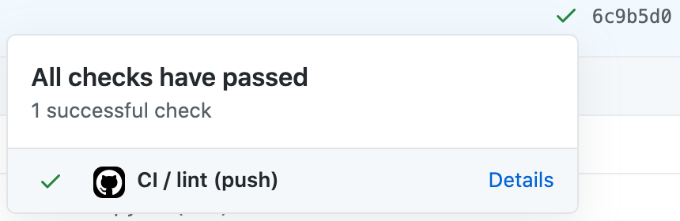
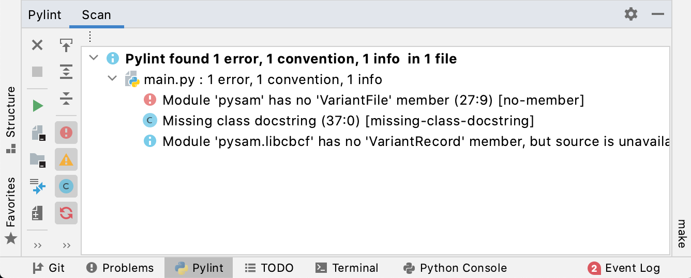
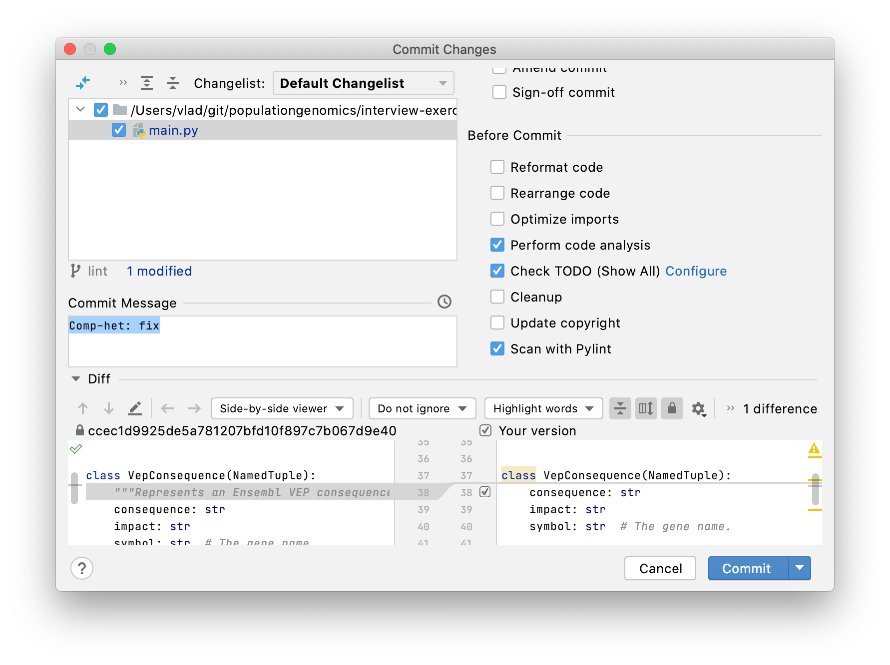

# Python Code Style

We use [pylint](https://www.pylint.org/) to perform automatic code checks on our
repositories. It helps us in implementing a consistent coding style throughout
our code base, and also does some static code analysis to catch potential
programming errors.

## Setting up a new project

When creating a new repository that contains Python code, please add this 
pylint configuration file into the repository root folder:

```
wget https://raw.githubusercontent.com/populationgenomics/team-docs/main/pylint/pylintrc \
   -O .pylintrc
```

You may want to disable additional inspections if pylint hits a false positive.
For example, it might fail to recognise imports of third-party libraries, in
which case you can add E0401 ("Unable to import") to the comma-separated list:

```sh
disable=f-string-without-interpolation,inherit-non-class,too-few-public-methods,E0401
```

In addition to `.pylintrc`, create a GitHub Actions CI workflow under
`.github/workflows/main.yaml` with the following contents (or add the `lint` 
job to an exsting workflow):

```sh
mkdir -p .github/workflows
wget https://raw.githubusercontent.com/populationgenomics/team-docs/main/pylint/github-workflow.yaml \
  -O .github/workflows/main.yaml
```

This will make GitHub run Pylint on every push and pull request, and display
checks in the web interface.



## Running Pylint

To install Pylint into your environment, run:

```bash
pip install pylint pylint-quotes
```

`pylint-quotes` is a plugin to Pylint that adds checks of the consistency 
of quotes (we stick to single quotes, with the only reason to prefer them 
over double quotes being the visual noise).

To run Pylint manually, you can use:

```bash
pylint **/*.py
```

## Visual Studio Code

Visual Studio Code auto-detects a .pylintrc file in the project root and asks
the user whether to install pylint, if it's not installed already.

## PyCharm

1. Make sure you have pylint installed with pip or conda.

2. Install a PyCharm "Pylint" plugin ([Preferences] > [Plugins] > search for
   "Pylint"). It will automatically find the pylint executable. A new tool
   window called Pylint will be added. You can use it to scan the project:

   

3. You can also enable real-time inspections by going to:
   Go to Preferences > Editor > Inspections > enable "Pylint real-time scan".
   However, it's not recommended as it's has a negative impact on system
   performance.

4. Pylint has a pre-commit hook integrated into a PyCharm commit modal window (
   Cmd+K). Make sure the "Scan with Pylint" checkbox is enabled:

   

Note that PyCharm comes with very useful and advanced built-in inspections out
of the box; however, they don't fully overlap with pylint, so it's useful to
have both.
