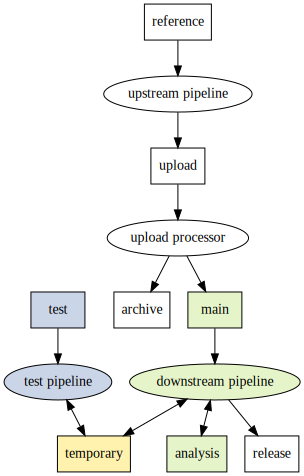

# Storage policies

This document describes where our production datasets are stored, how [object
lifecycles](https://cloud.google.com/storage/docs/lifecycle)
are configured, and how access permissions are managed.

We are trying to strike a balance between:

- Quick development iterations and unlimited ad-hoc data exploration.
- Robust, reproducible pipelines, using only strictly necessary cloud
  resources.

This motivates two somewhat unusual principles in the design:

- Quick development iterations and testing only happens on a small (but
  representative) subset of the data (blue highlight in the graph below). The
  full dataset is only accessible through code that has been reviewed and
  committed (green highlight in the graph below).
- All outputs are versioned and immutable, except for purely temporary
  results (yellow highlight in the graph below). Since "production runs" of
  pipelines only happen after sufficient testing on subsets of the data,
  immutable results generally shouldn't cause a lot of churn or resource
  usage.

## Typical data flow



## Buckets

In this context, a stack corresponds to a particular project / effort, e.g.
*TOB-WGS* or *RDNow*, with separate buckets and permission groups. Below,
`$STACK` is a placeholder for the name of that effort, e.g. `$STACK` =
`tob-wgs`.

Currently, all buckets reside in the `australia-southeast1` GCP region. It's
therefore essential that all computation happens in that region too, to avoid
network egress costs.

In general, all datasets within buckets should be versioned, using a simple
major-minor naming scheme like `gs://cpg-$STACK-main/qc/v1.2/`. We don't have
a strict semantic definition to distinguish between major and minor version
increments. The addition of significant numbers of samples or the use of a
substantially different analysis method usually justifies a major version
increase.

## reference: `gs://cpg-reference`

This bucket contains reference data that's independent of any particular stack,
e.g. the GRCh38 human reference genome sequences used for alignment, the
GENCODE GTF used for functional annotations, the version of dbSNP used to add
rsIDs, etc. These resource "bundles" are versioned together.

Most pipelines will depend on this bucket to some degree.

Files stay in Standard Storage indefinitely.

Everybody in the organization has viewer permissions.

## upload: `gs://cpg-$STACK-upload`

This bucket contains files uploaded from sequencing providers, as a staging
area.

The main use case for this category are raw sequencing reads (e.g. CRAM
files) and derived data from initial production pipelines: QC metrics
including coverage results, and additional outputs from variant callers (e.g.
structural variants, repeat expansions, etc.), and GVCFs.

An upload processor pipeline moves these files into the *archive* and *main*
buckets in batches, creating new releases.

Files stay in Standard Storage indefinitely, but are cleared up regularly by
the upload processor.

Access is restricted to service accounts that run workflows. Sequencing
providers have creator permissions, using a service account.

## archive: `gs://cpg-$STACK-archive`

This bucket contains files for *archival purposes*: long term storage is
cheap, but *retrieval is very expensive*.

The main use case for this category are raw sequencing reads (e.g. CRAM
files). After conversion to Hail MatrixTables, GVCF files can potentially be
stored here as well.

Files stay in Standard Storage for 30 days, before their storage class gets
changed to Archive Storage. This allows workflows to do post-processing of the
data shortly after initial creation (e.g. copying windowed regions of raw reads
around interesting variants) before retrieval becomes expensive.

Access is restricted to service accounts that run workflows, to avoid
accidental retrieval costs incurred by human readers.

## main: `gs://cpg-$STACK-main`

This bucket contains *input* files that are frequently accessed for analysis.
Long term storage is expensive, but retrieval is cheap.

The main use case for this category are Hail tables (e.g. merged GVCF files),
metadata, SV caller outputs, transcript abundance files, etc.

Files stay in Standard Storage indefinitely.

Human users only get listing permissions, but viewer permissions are granted
indirectly through the [analysis runner](#analysis-runner) described below.
This avoids high costs through code that hasn't been reviewed. See the *test*
bucket below if you're developing / prototyping a new pipeline.

## test: `gs://cpg-$STACK-test`

This bucket contains *input* test data, which usually corresponds to a subset
of the data stored in the *main* bucket. Long term storage is expensive, but
retrieval is cheap.

The main use case is to iterate quickly on new pipelines during development.
This bucket contains representative data, but given the much smaller dataset
size the risk of accidental high cloud computing costs is greatly reduced.

Files stay in Standard Storage indefinitely.

Human users only get viewer permissions, so pipeline code doesn't need to be
reviewed before this data can be read.

## analysis: `gs://cpg-$STACK-analysis`

This bucket contains files that are frequently accessed for analysis.

Long term storage is expensive, but retrieval is cheap.

The main use case for this category are analysis results derived from the
*main* bucket, which in turn can become inputs for further analyses.

Files stay in Standard Storage indefinitely.

Human users only get viewer permissions, but creator permissions are granted
indirectly through the [analysis runner](#analysis-runner) described below.

## temporary: `gs://cpg-$STACK-temporary`

This bucket contains files that only need to be retained *temporarily* during
analysis or workflow execution. Retrieval is cheap, but old files get
automatically deleted.

The main use case for this category are Hail "checkpoints" that cache results
while repeatedly running an analysis during development.

Files that are older than 30 days get deleted automatically.

Human users get admin permissions, so care must be taken not to accidentally
overwrite / delete each other's results (e.g. by avoiding naming collisions
through a file name prefix).

## release: `gs://cpg-$STACK-release-requester-pays`

This bucket contains data that's shared with other researchers or is publicly
available. Long term storage is expensive, but network egress costs are
covered by the users who download the data.

The main use case for this category are aggregate results that are made
publicly available or snapshots of datasets that are shared with other
researchers through restricted access.

Files stay in Standard Storage indefinitely.

Human users only get viewer permissions, to reduce the risk of accidental
modification / deletion of files.

## Deletion

By default, human users can't delete objects in any bucket except for the
*temporary* bucket. This avoids accidental deletion of results and makes sure
our pipelines stay reproducible. However, it will sometimes be necessary to
delete obsolete results, mainly to reduce storage costs. Please coordinate
directly with the software team in such cases.

All buckets retain one noncurrent object version for 30 days, after which
noncurrent files get deleted. This allows "undelete" recovery in case of
accidental deletion.

## Access permissions

Permissions are managed through IAM, using access groups.

- `$STACK-restricted-access@populationgenomics.org.au`: human users are added
  to this group to gain permissions as described above. Membership should
  usually expire after a year, after which continued access will require a
  membership renewal.
- `$STACK-extended-access@populationgenomics.org.au`: grants members admin
  permissions to all buckets. This should generally only be necessary for
  service accounts and very rarely for human users (in which case membership
  should expire after a short amount of time).
- `$STACK-release-access@populationgenomics.org.au`: grants members viewer
  permissions to the *release* bucket. Only required if the releases are not
  public. This usually includes users outside the CPG, in which case they
  must use Google accounts. Membership should usually expire after a year,
  after which continued access will require a membership renewal.

## Analysis runner

To encourage reproducible workflows and code getting reviewed before it's run
on "production data", viewer permissions to the *main* bucket and creator
permissions to the *analysis* bucket are available only through the analysis
runner. The typical workflow looks like this:

1. Protoype and iterate on your pipeline using the *test* bucket for input and
   the *temporary* bucket for outputs.
1. Once you're ready to run your pipeline on the *main* bucket for input,
   create a pull request to get your code reviewed.
1. After your pull request has been merged, note the corresponding git commit
   hash. Invoke the analysis runner with that commit hash, which will run the
   pipeline on your behalf and store additional metadata.

For more detailed instructions and examples, look at the
[analysis runner repository](https://github.com/populationgenomics/analysis-runner).

If this causes too much friction in your daily work, please don't work around
the restrictions. Instead, reach out to the software team, so we can work
on process improvements together.

## Automation

Buckets and permission groups can be brought up using Pulumi.

1. Create a new GCP project for the stack, corresponding to `$PROJECT` below.
1. Configure the Pulumi stack options:
   - See this [issue](https://github.com/hashicorp/terraform-provider-google/issues/7477)
     regarding the use of the `user_project_override` and `billing_project`
     options below.
   - You can find your organization's `$CUSTOMER_ID` (used for creating Cloud
     Identity IAM groups) using [Resource Manager](https://cloud.google.com/resource-manager/reference/rest/v1/organizations/search).

   ```shell
   cd stack
   pulumi stack init $STACK
   pulumi config set gcp:project $PROJECT
   pulumi config set gcp:billing_project $PROJECT
   pulumi config set gcp:user_project_override true
   pulumi config set customer_id $CUSTOMER_ID
   ```

   - If you want to create a release bucket and access group:

     ```shell
     pulumi config set enable_release true
     ```

   - If you want to customize the archival age in days:

     ```shell
     pulumi config set archive_age 90
     ```

1. Deploy the stack:

   ```shell
   gcloud auth application-default login
   python3 -m venv venv
   source venv/bin/activate
   pip3 install -r requirements.txt
   pulumi up
   ```
