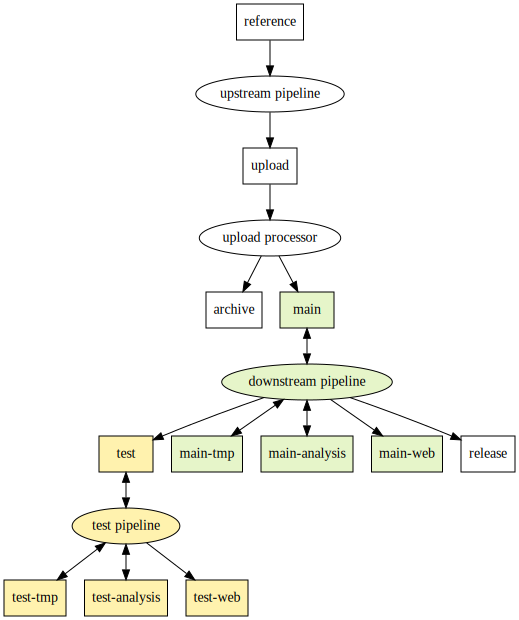

# Storage policies

- [Storage policies](#storage-policies)
  - [Typical data flow](#typical-data-flow)
  - [Buckets](#buckets)
    - [reference: `gs://cpg-reference`](#reference-gscpg-reference)
    - [upload: `gs://cpg-<dataset>-upload`](#upload-gscpg-dataset-upload)
    - [archive: `gs://cpg-<dataset>-archive`](#archive-gscpg-dataset-archive)
    - [main: `gs://cpg-<dataset>-main`](#main-gscpg-dataset-main)
    - [test: `gs://cpg-<dataset>-test`](#test-gscpg-dataset-test)
    - [tmp: `gs://cpg-<dataset>-{main,test}-tmp`](#tmp-gscpg-dataset-maintest-tmp)
    - [metadata: `gs://cpg-<dataset>-{main,test}-metadata`](#metadata-gscpg-dataset-maintest-metadata)
    - [web: `gs://cpg-<dataset>-{main,test}-web`](#web-gscpg-dataset-maintest-web)
    - [release: `gs://cpg-<dataset>-release-requester-pays`](#release-gscpg-dataset-release-requester-pays)
  - [Deletion](#deletion)
  - [Access permissions](#access-permissions)
  - [Analysis runner](#analysis-runner)
  - [Deployment](#deployment)

This document describes where our production datasets are stored, how
[object lifecycles](https://cloud.google.com/storage/docs/lifecycle) are
configured, and how access permissions are managed.

We are trying to strike a balance between:

- Quick development iterations and unlimited ad-hoc data exploration.
- Robust, reproducible pipelines, using only strictly necessary cloud resources.

This motivates two somewhat unusual principles in the design:

- Quick development iterations and testing only happens on a small (but
  representative) subset of the data (blue highlight in the graph below). The
  full dataset is only accessible through code that has been reviewed and
  committed (green highlight in the graph below).
- All outputs are versioned and immutable, except for purely temporary results
  (yellow highlight in the graph below). Since "production runs" of pipelines
  only happen after sufficient testing on subsets of the data, immutable results
  generally shouldn't cause a lot of churn or resource usage.

## Typical data flow

## `main` vs `test`

The above workflow of quick iteration on the _test_ bucket with subsequent "production" runs on the _main_ bucket works best if:

- The **structure** of the data in the _test_ bucket mirrors the _main_ bucket closely (e.g. same folder organization, table schemas, etc).
- The **content** of the data in the _test_ bucket is a consistent subset of the _main_ bucket. E.g. an initial joint-called MatrixTable contains 20 samples in _test_ vs 20k samples in _main_.

Whenever a subsequent analysis is run, ideally the derived results should be generated in both the _main_ and _test_ buckets. For example, aggregate statistics for the above MatrixTable should be generated for the 20 samples in _test_ in the same way as the 20k samples in _main_. This makes subsequent prototyping of pipelines much easier.

## Bucket details

In this context, a dataset corresponds to a particular project / effort, e.g.
_TOB-WGS_ or _RDNow_, with separate buckets and permission groups. Below,
`<dataset>` is a placeholder for the name of that effort, e.g. `<dataset>` =
`tob-wgs`.

Currently, all buckets reside in the `australia-southeast1` GCP region. It's
therefore essential that all computation happens in that region too, to avoid
network egress costs.

In general, all datasets within buckets should be versioned, using a simple
major-minor naming scheme like `gs://cpg-<dataset>-main/qc/v1.2/`. We don't have a
strict semantic definition to distinguish between major and minor version
increments. The addition of significant numbers of samples or the use of a
substantially different analysis method usually justifies a major version
increase.

### reference: `gs://cpg-reference`

- **Description**: Contains reference data that's independent of any particular
  dataset, e.g. the GRCh38 human reference genome sequences used for alignment,
  the GENCODE GTF used for functional annotations, the version of dbSNP used to
  add rsIDs, etc. These resource "bundles" are versioned together.
  Most pipelines will depend on this bucket to some degree.
- **Storage**: Standard Storage indefinitely.
- **Access**: Everybody in the organisation has viewer permissions.

### upload: `gs://cpg-<dataset>-upload`

- **Description**: Contains files uploaded from collaborators and sequencing providers,
  as a general staging area.
- **Main use case**: Raw sequencing reads (e.g. CRAM files) and derived data
  from initial production pipelines: QC metrics including coverage results,
  additional outputs from variant callers (e.g. structural variants,
  repeat expansions, etc.), and GVCFs. An upload processor pipeline moves these
  files into the _archive_ and _main_ buckets in batches, creating new releases.
- **Storage**: Standard Storage indefinitely, but cleared up regularly by
  the upload processor.
- **Access**: Human users get viewer permissions, to inspect the files before e.g.
  moving a subset of the data to the _test_ bucket. Moving data from the _upload_
  bucket to the _main_ bucket is restricted to service accounts that run workflows.
  Sequencing providers have creator permissions, using a service account.

### archive: `gs://cpg-<dataset>-archive`

- **Description**: Contains files for _archival purposes_, where long term
  storage is cheap, but _retrieval is very expensive_.
- **Main use case**: Raw sequencing reads (e.g. CRAM files) and potentially
  GVCFs (after conversion to Hail MatrixTables).
- **Storage**: Standard Storage for 30 days, before changing to Archive Storage.
  This allows workflows to do post-processing of the data shortly after initial
  creation (e.g. copying windowed regions of raw reads around interesting
  variants) before retrieval becomes expensive.
- **Access**: Restricted to service accounts that run workflows, to avoid
  accidental retrieval costs incurred by human readers.

### main: `gs://cpg-<dataset>-main`

- **Description**: Contains files that are frequently accessed for
  analysis. Long term storage is expensive, but retrieval is cheap.
- **Main use case**: Hail tables (e.g. merged GVCF files), metadata, SV caller
  outputs, transcript abundance files, analysis outputs, etc.
- **Storage**: Standard Storage indefinitely.
- **Access**: Human users only get listing permissions, but viewer permissions
  are granted indirectly through the [analysis runner](#analysis-runner)
  described below. This avoids high costs through code that hasn't been
  reviewed. See the _test_ bucket below if you're developing / prototyping a new
  pipeline.

### test: `gs://cpg-<dataset>-test`

- **Description**: Contains test data, which usually has identical structure to what's
  stored in the _main_ bucket, but it's only a small subset of the of the overall
  dataset. Long term storage is expensive, but retrieval is cheap.
- **Main use case**: Iterate quickly on new pipelines during development.
  This bucket contains representative data, but given the much smaller dataset
  size the risk of accidental high cloud computing costs is greatly reduced.
- **Storage**: Standard Storage indefinitely.
- **Access**: Human users get admin permissions, so pipeline code doesn't need to be
  reviewed before this data can be read or written.

### tmp: `gs://cpg-<dataset>-{main,test}-tmp`

- **Description**: Contains files that only need to be retained _temporarily_
  during analysis or workflow execution. Retrieval is cheap, but old files get
  automatically deleted.
- **Main use case**: Hail "checkpoints" that cache results while repeatedly
  running an analysis during development.
- **Storage**: Files that are older than 30 days get deleted automatically.
- **Access**: Same as the corresponding _main_ and _test_ buckets.

### metadata: `gs://cpg-<dataset>-{main,test}-metadata`

- **Description**: Contains metadata files, like QC metrics for sequencing results,
  sample and variant QC summaries, phenotypical information, pedigrees, tables derived
  from the [sample metadata database](https://github.com/populationgenomics/sample-metadata), etc.
- **Main use case**: Summary information from analyses, but also inputs for e.g. GWAS.
  Often, these files will be processed further to produce human-readable reports in the
  `web` bucket.
- **Storage**: Standard Storage indefinitely.
- **Access**: Same as the corresponding _main_ and _test_ buckets, with additional
  viewer permissions for humans.

### web: `gs://cpg-<dataset>-{main,test}-web`

- **Description**: Contains static web content, like QC reports as HTML pages,
  which is served through an access-restricted web server.
- **Main use case**: Human-readable analysis results, like reports and notebooks.
- **Storage**: Standard Storage indefinitely.
- **Access**: Same as the corresponding _main_ and _test_ buckets, with additional
  viewer permissions for humans.

  Files in this bucket can be viewed easily through URLs of the form `https://main-web.populationgenomics.org.au/<dataset>/filepath/example.html`, which serves the file at `gs://cpg-<dataset>-main-web/filepath/example.html`. Analogously, there's a `test-web.populationgenomics.org.au` domain for the `test-web` bucket. Access to this web server is controlled through the `<dataset>-web-access@populationgenomics.org.au` group.

### release: `gs://cpg-<dataset>-release-requester-pays`

- **Description**: Contains data that's shared with other researchers or is
  publicly available. Long term storage is expensive, but network egress costs
  are covered by the users who download the data.
- **Main use case**: Aggregate results that are made publicly available or
  snapshots of datasets that are shared with other researchers through
  restricted access.
- **Storage**: Standard Storage indefinitely.
- **Access**: Human users only get viewer permissions, to reduce the risk of
  accidental modification / deletion of files.

## Deletion

By default, human users can't delete objects in any bucket except for the
_test_ buckets. This avoids accidental deletion of results and makes sure
our pipelines stay reproducible. However, it will sometimes be necessary to
delete obsolete results, mainly to reduce storage costs. The necessary permissions
are granted through the [`full` access level](#analysis-runner).

All buckets retain one noncurrent object version for 30 days, after which
noncurrent files get deleted. This allows "undelete" recovery in case of
accidental deletion.

## Access permissions

Permissions are managed through IAM, using access groups.

- `<dataset>-access@populationgenomics.org.au`: human users are added to this group to
  gain permissions as described above. Users should also be added to the
  corresponding Hail billing project, so they can see the batches launched through
  the [analysis runner](#analysis-runner).
- `<dataset>-release-access@populationgenomics.org.au`: grants members viewer
  permissions to the _release_ bucket. Only required if the releases are not
  public. This usually includes users outside the CPG, in which case they must
  use Google accounts.

## Analysis runner

To encourage reproducible workflows and code getting reviewed before it's run on
"production data", access to the _main_ bucket are available only through the
[analysis runner](#analysis-runner).

There are three distinct access levels: _test_, _standard_, and _full_.

- **test**: Prototype and iterate on your pipeline using the _test_ access level. This
  will give you permissions to view and create files in all the _test_ buckets. You don't
  need to get your code reviewed, but it needs to be pushed to a remote branch in the
  _populationgenomics_ GitHub organization in order for the analysis runner to work. This access level also applies when using [notebooks](../notebooks.md). In
  summary:
  - **Access level**: _test_
  - **View / create**: Any _test_ bucket
  - **GitHub**: no PR, just push to remote branch
- **standard**: Once you're ready to run your pipeline on the _main_ buckets, create
  a pull request to get your code reviewed. Once your code has been merged in the `main`
  branch, run the analysis runner using the _standard_ access level. In summary:
  - **Access level**: _standard_
  - **View / create**: Any _main_ or _test_ bucket
  - **GitHub**: PR merged to `main` branch
- **full**: If you ever need write access to other buckets, e.g. to move data from the
  _upload_ bucket or delete files in the _main_ bucket, you can get full write / delete access to all buckets using the _full_ access
  level. However, to reduce risk of accidental data loss, only request this access
  level if you really need it. In summary:
  - **Access level**: _full_
  - **View / create / delete**: anywhere
  - **GitHub**: PR merged to `main` branch

For more detailed instructions and examples, look at the
[analysis runner repository](https://github.com/populationgenomics/analysis-runner).

If this causes too much friction in your daily work, please don't work around
the restrictions. Instead, reach out to the software team, so we can work on
process improvements together.

## Deployment

See the [analysis runner repository](https://github.com/populationgenomics/analysis-runner/tree/main/stack)
for the deployment configuration that can be used to bring up a stack
corresponding to a dataset.
