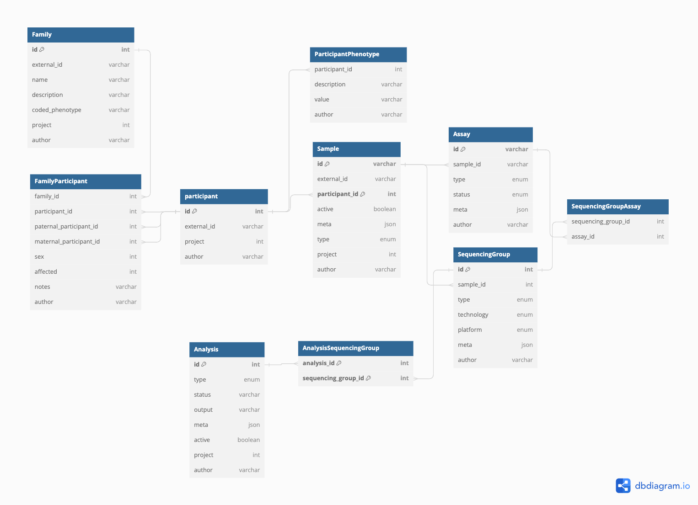
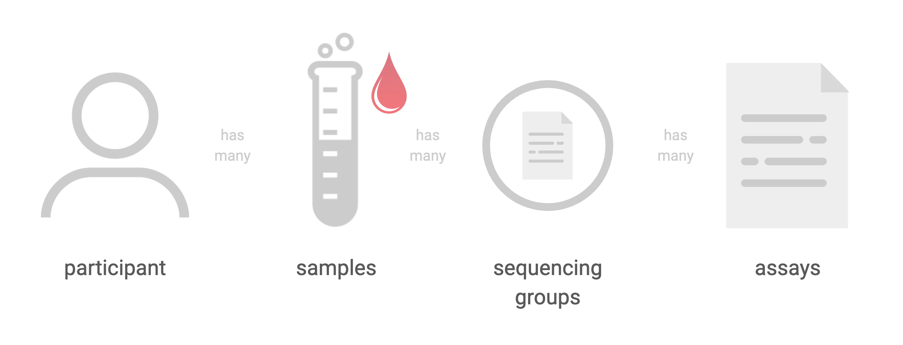
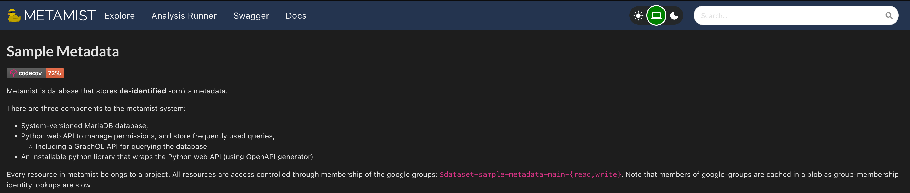
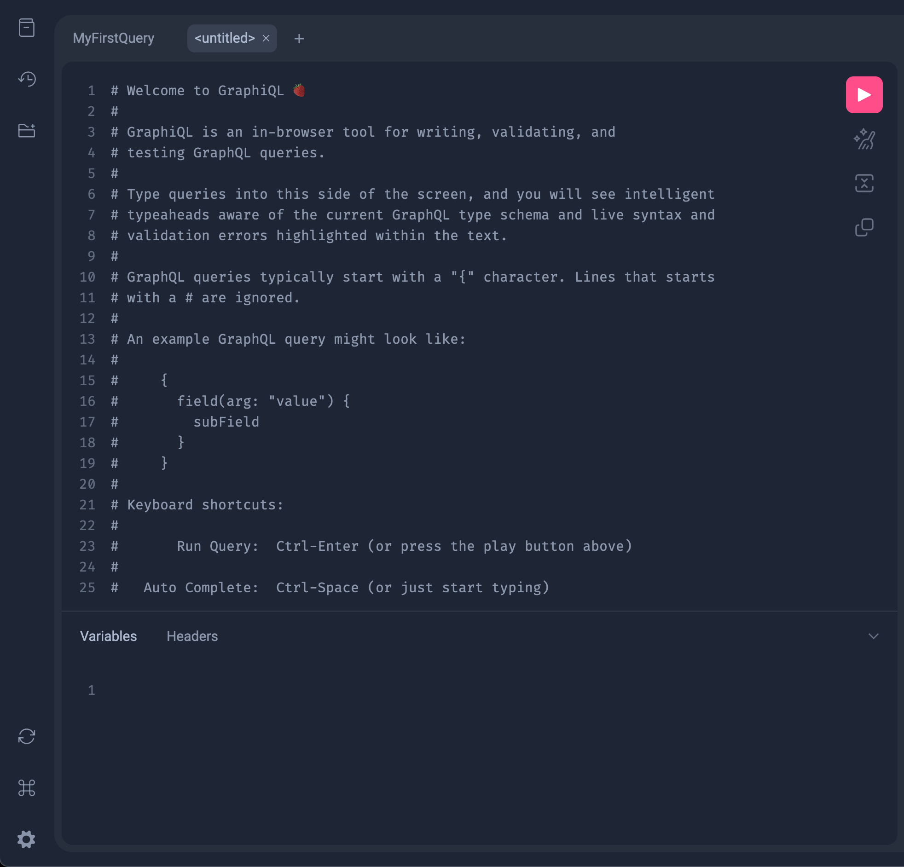
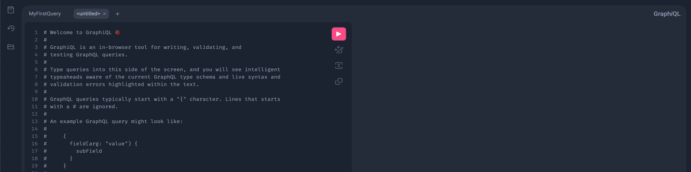
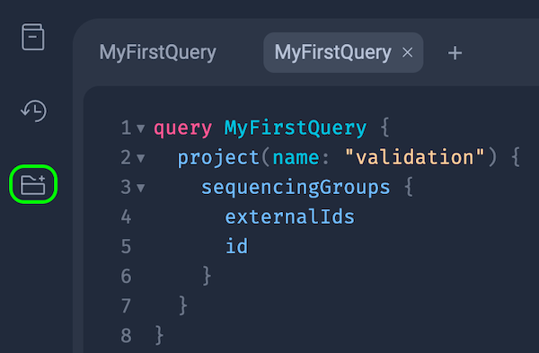

# Introduction

This documentation is meant to act as a partner to the 'context' documentation. The aim of the following exercises is to allow you to get first hand experience working with the CPG codebase, the tools used to conduct analyses, as well as the supporting infrastructure that enables the ingestion, management, and utilisation of data.

### Goals
- browse metamist through browser
    - table view
    - explanation of what they're looking at
        - e.g. sequencing group id's, external id's
    - batch collaborator submission - need to cover???
- building python script to query metamist
- fetch external/CPG id's
- fetch file locations
- checking progress on samples (i.e. if a cram file already exists)
- interacting with files/viewing files with `gsutil` command


Steps I can think of  
# 1. Query metamist for FQ files

The first step in understanding Metamist is to understand how to query the database so that we can get the necessary information on our samples. Metamist is used to track file locations, participant id's, status' of samples (i.e. the location of the files on Google Cloud, whether the the .fastq files have been converted to .cram, whether there is a .vcf file available, and whether the sample has been joint called with other samples). Metamist is CPG's way of keeping track of everything. 

Metamist is built on a GraphQL infrastructure. GraphQL is a query language for APIs that provides a more efficient and flexible alternative to traditional RESTful APIs. It allows clients to request exactly the data they need, and nothing more, by specifying the structure of the response in the query itself. This reduces over-fetching and under-fetching of data. 

**Note:** In your everyday use of Metamist, many of the interactions happen seamlessly in the background, shielded from the user. Nevertheless, having an understanding of Metamist's inner workings is crucial because it forms the core of CPG. When operating at the pipeline level, there's usually no need for manual query construction; the pipeline handles this complexity for users. However, possessing this knowledge remains vital, particularly for those wishing to delve deeply into the specifics of individual participants or components.

Before diving in to Metamist, it's important to understand the structure of the data. The following diagram shows the relationship between the different entities in the CPG database.



The core concept of Metamist is a `SequencingGroup`. 

- A `SequencingGroup` is essentially a set of reads that are output of one `Assay`. Each `Assay` represents a collection of files generated from a single sequencing run. These `Assays`, in turn, consist of one or more `Reads`. A `Read` is essentially a single file containing the raw reads from a specific lane in the sequencing process.
  - At this point an `Assay` is either genome or exome sequencing but could refer to genotyping arrays/proteomics/RNA assays etc. in the future.
- Importantly, a `SequencingGroup` is always tied to a single participant and never spans across multiple patient samples. It's a way to categorise the type of sequencing conducted, like genome or exome sequencing. For example, if an individual undergoes both genome and exome sequencing, you'll have two distinct `SequencingGroups`, each corresponding to one of these sequencing types.
- When we trace back from a `SequencingGroup` to a `Participant`, we see that participants contribute `Samples` linked by a unique `participant_id`. A `Participant` essentially represents an individual who has provided samples for genetic analysis. It's possible for a single `Participant` to have multiple samples, which enables us to gather comprehensive genetic insights from the same individual.
- Furthermore, tracing back from a `SequencingGroup` to a `Family`, we discover that a `Family` comprises participants who share genetic relationships. External collaborators use external IDs to refer to families, while our internal system assigns both family and participant IDs to facilitate efficient tracking.
- ***Summary:*** `Samples` are linked by a unique `participant_id`. The physical sample taken from the participant at a time and place. `Assays` are performed on this sample to produce `reads`, these collectioms of fastq files (i.e. the `reads`) are what are referred to as a `SequencingGroup`. If we were to go back and re-run an assay on that sample, this would produce a new `SequencingGroup`
  


Let's first work with Metamist and GraphQL using the GUI. Navigate to https://sample-metadata.populationgenomics.org.au/ to see the homepage of CPG's Metamist implementation. 




### GraphQL

GraphQL stands for 'Query Language,' signifying a specific syntax designed for querying servers or performing data mutations. Unlike RESTful APIs, which typically feature multiple endpoints for different resources, each with its set of endpoints for various HTTP methods like GET, POST, DELETE, and PUT, GraphQL streamlines this with a single endpoint. This single endpoint efficiently handles queries and mutations, reducing the number of required server requests.

To send a query to a GraphQL server, you utilise GraphQL syntax. This syntax differs from the structure used in RESTful API requests. A GraphQL query takes the form of:

```graphql
query MyFirstQuery { # can save query for future use
  project(name: "validation") {
    sequencingGroups {
      externalIds
      id
    }
  }
}
```
Breaking down the above query:
- `query MyFirstQuery` is the name of the query. This is optional, but it's good practice to name your queries.
  - project with the name "validation."
      - Inside this project, retrieve information about:
          - `sequencingGroups`
              - Within each `sequencingGroup`, fetch data about:
                  - external ID's and the ID of the `sequencingGroup`

***query attributes, is_active example to put in query***

This is great because it means that we can get all the information we need in a single request. We don't need to make multiple requests to get the information we need, and there is no under-fetching or over-fetching of data.

Let's see this request in action. The single GraphQL endpoint for CPG's Metamist is https://sample-metadata.populationgenomics.org.au/graphql. This is the endpoint that we'll be sending our queries to. Navigate to this endpoint in your browser. You should see the following:



As the homepage says this is an interface for building your GraphQL queries. Let's try sending the query we wrote above. Copy and paste the query into the left hand side of the screen and press the play button in the top right hand corner. You should see the following:


|  |  |
| - | - |
| As an aid to help build queries, GraphiQL provides a user interface that allows you to explore the schema of the GraphQL server. The schema is essentially a description of the data that is available on the server. You can see the schema by clicking on the 'GraphiQL Explorer' button on the left hand side. You should see the following: |  | 

This user interface is great to building and testing your queries that can eventually be used in code.

###  Exercise 1:
- Using the GraphiQL interface, within `project` 'validation' write a query that returns the metadata (`meta`) of the `assays` as well as the `externalID` of the `sample` corresponding to the `SequencingGroup` with the `id` of `CPG276394`. 

<details>
  <summary>Click to see answer</summary>
  
  ```graphql
  query MyQuery {
    project(name: "validation-test") {
      sequencingGroups(id: {eq: "CPG276394"}) {
        assays {
          meta
        }
        sample {
          externalId
        }
      }
    }
  }
  ```
</details>  

Next, let's try sending this query using Python. We'll be using the `sample-metadata` Python package to do this. This package is a wrapper around the `requests` package that makes it easier to send GraphQL queries to the Metamist server.

You will first need to install `metamist` using `pip`. You can do this by running the following command in your terminal:  
```python
pip install metamist==6.2.0
```

Now that you have `metamist` installed, let's try sending the query we wrote above using Python. Create a new Python file called `query_metamist.py` and copy and paste the above code into it.

```python
from metamist.graphql import gql, query
import json

_query = gql(
    """
query MyQuery {
  project(name: "validation-test") {
    sequencingGroups(id: {eq: "CPG276394"}) {
      assays {
        meta
      }
      sample {
        externalId
      }
    }
  }
}
"""
)
# here we're just printing the output of the query in a nice format
print(json.dumps(query(_query), indent=4))
```

Running the above script in the terminal will print the output of the query in a nice readable json format. You should see the following:

<details>
  <summary>Click to show output</summary>
    
    {
        "project": {
            "sequencingGroups": [
                {
                    "assays": [
                        {
                            "meta": {
                                "reads_type": "fastq",
                                "reads": [
                                    {
                                        "location": "gs://cpg-validation-test-upload/220802_NA12878_twist/201003_A00692_0145_ML207619_NA12878_MAN-20201001_TwistWES1VCGS1_L000_DS_R1.fastq.gz",
                                        "basename": "201003_A00692_0145_ML207619_NA12878_MAN-20201001_TwistWES1VCGS1_L000_DS_R1.fastq.gz",
                                        "class": "File",
                                        "checksum": null,
                                        "size": 2011367540
                                    },
                                    {
                                        "location": "gs://cpg-validation-test-upload/220802_NA12878_twist/201003_A00692_0145_ML207619_NA12878_MAN-20201001_TwistWES1VCGS1_L000_DS_R2.fastq.gz",
                                        "basename": "201003_A00692_0145_ML207619_NA12878_MAN-20201001_TwistWES1VCGS1_L000_DS_R2.fastq.gz",
                                        "class": "File",
                                        "checksum": null,
                                        "size": 2054099257
                                    }
                                ],
                                "sequencing_type": "exome",
                                "sequencing_technology": "short-read",
                                "sequencing_platform": "illumina",
                                "status": "uploaded"
                            }
                        }
                    ],
                    "sample": {
                        "externalId": "VCGS_NA12878"
                    }
                }
            ]
        }
    }

</details>

In the above output we can see that for `SequencingGroup` `CPG276394` there is a set of reads (forward and reverse) that have been uploaded to Google Cloud Storage. We can also see that the `sequencing_type` is `exome` and the `sequencing_technology` is `short-read`. We can also see that the `externalId` of the `sample` is `VCGS_NA12878`.


  - what you are requesting are as structured as what you get back. 
  - when data is added it's added to the upload folder, these are picked up by pipeline, turned into crams and fastq's are thrown out
  - data in one environment when copied to another environment, the CPG ID will be replcaed with a completely fresh identifier (due to uniqueness requirements)
  - go over how a set of sequencing data relates to a person
  - everything is mediated through metamist - keeps track of progress of analysis of samples
      - demonstrate this???
  - at a pipeline level, there's very little need to actually build a query by hand, the pipeline abstracts this away from the user. but it is still essential knowledge, especially if one wants to take a deep dive into a specific participant

- GraphQL query:
    ```
    query MyQuery {
      project(name: "validation-test") {
        sequencingGroups(id: {eq: "CPG276394"}) {
          assays {
            meta
          }
          sample {
            externalId
          }
        }
      }
    }
    ```    
        
- Python script:
    ```
    from sample_metadata.graphql import query
    _query = """
    query MyQuery {
    project(name: "validation-test") {
        sequencingGroups(id: {eq: "CPG276394"}) {
        id
        assays {
            meta
        }
        }
    }
    }
    """
    print(query(_query))
    ```
- The output of the above query is:
{'project': {'sequencingGroups': [{'id': 'CPG276394', 'assays': [{'meta': {'reads_type': 'fastq', 'reads': [{'location': 'gs://cpg-validation-test-upload/220802_NA12878_twist/201003_A00692_0145_ML207619_NA12878_MAN-20201001_TwistWES1VCGS1_L000_DS_R1.fastq.gz', 'basename': '201003_A00692_0145_ML207619_NA12878_MAN-20201001_TwistWES1VCGS1_L000_DS_R1.fastq.gz', 'class': 'File', 'checksum': None, 'size': 2011367540}, {'location': 'gs://cpg-validation-test-upload/220802_NA12878_twist/201003_A00692_0145_ML207619_NA12878_MAN-20201001_TwistWES1VCGS1_L000_DS_R2.fastq.gz', 'basename': '201003_A00692_0145_ML207619_NA12878_MAN-20201001_TwistWES1VCGS1_L000_DS_R2.fastq.gz', 'class': 'File', 'checksum': None, 'size': 2054099257}], 'sequencing_type': 'exome', 'sequencing_technology': 'short-read', 'sequencing_platform': 'illumina', 'status': 'uploaded'}}]}]}}

Making it a bit more human-readable:
```
{
  "data": {
    "project": {
      "sequencingGroups": [
        {
          "assays": [
            {
              "meta": {
                "reads_type": "fastq",
                "reads": [
                  {
                    "location": "gs://cpg-validation-test-upload/220802_NA12878_twist/201003_A00692_0145_ML207619_NA12878_MAN-20201001_TwistWES1VCGS1_L000_DS_R1.fastq.gz",
                    "basename": "201003_A00692_0145_ML207619_NA12878_MAN-20201001_TwistWES1VCGS1_L000_DS_R1.fastq.gz",
                    "class": "File",
                    "checksum": null,
                    "size": 2011367540
                  },
                  {
                    "location": "gs://cpg-validation-test-upload/220802_NA12878_twist/201003_A00692_0145_ML207619_NA12878_MAN-20201001_TwistWES1VCGS1_L000_DS_R2.fastq.gz",
                    "basename": "201003_A00692_0145_ML207619_NA12878_MAN-20201001_TwistWES1VCGS1_L000_DS_R2.fastq.gz",
                    "class": "File",
                    "checksum": null,
                    "size": 2054099257
                  }
                ],
                "sequencing_type": "exome",
                "sequencing_technology": "short-read",
                "sequencing_platform": "illumina",
                "status": "uploaded"
              }
            }
          ]
        }
      ]
    }
  }
}
```

# 2. Build and publish a FQE image  
- obvs FastQE wouldn't be used in production, but it is an example of a tool we don't have in our library, so you'd have to build a docker image to do that

```
FROM python:3.10

WORKDIR /app

ARG VERSION=${VERSION:-0.3.1}

RUN pip install fastqe==${VERSION}
```
CLI command to build the image
```
docker build -t fastqe_image:1.0.0 . --platform=linux/amd64
```

- two different types of images: super heavy, or super light
- if you want to access a file on google cloud while running inside a container, you need the google cloud sdk
    - probably be easier to pass files specifically into the runtime. the syntax of passing a file into a docker image is probably better from an educational perspective than interacting via google cloud sdk
- instead of starting on linux base image, can start on python base image (with ubuntu) then could just run pip install
    - python specific base image, then just run pip install for that one tool. pin the image to a specific python version.
    - discuss the tradeoffs of going with either approach
        - at the moment we have a base image with a bunch of stuff that is used a lot throughout CPG. which is good, this docker image is but and it means that we have to pay for the egress of this large docker image
- if fastqe doesnt know how to read a google cloud file, and we have gc sdk installed in our image, just do a gsutil cp <file_path> to image
    - hail batch has all this functionality built in

- reach out to milos for building docker image locally
- hail batch using the custom image
    - get analysis 

- once docker image is working locally, do a PR to get it merged
- Desp
  - Micromamba may just be an artifact
  - just use plain python and pip install stuff
  - need to push the image to the google cloud image repository, then submit the script using analysis runner. so the script will need to use hail batch
    - our images live in the google cloud image repository. give them a gcloud util command to upload to the project we're working on (tag the image with their name)
    - then write the script. hail batch job (i want this cpu size, batch image) then construct the bash command to run the tool. hail batch will run the bash command on the worker node
      - permissions for this? everything will get set up through cpg-infrastructure-private repo
      - different data analyst roles and their permissions? data analyst
        - discuss who they should go to to get permissions.
      - look at samtools.py as really simple example of hail batch job
    - submit the script through analysis-runner
  - need to have it on git to run through analysis-runner
# 3. Run the jobs through analysis runner
analysis-runner \
    --dataset validation-test \
    --description "test Run FastQE" \
    --access-level test \
    --output-dir <directory-within-bucket> \
    script_to_run.py with arguments

- whatever we set in the image flag is what EVERYTHING gets run in
    - in the analysis-runner docs it says that it uses the base image

# 4. Pull the output and visualise (presumably html)


GraphQL is the 


### Analyst
- https://hail.is/docs/0.2/tutorials/08-plotting.html#Plotting-Tutorial 
- where does an analysts job start?
    - essentially with a matrix table (the output of production pipelines)
    - version 7 matrix table in tob dataset is subsetted for a test bucket
        - who's responsible for subsetting data?
    - from an analysts perspective working with metamist may not be the best
- loading in a hail dataset
- running a pca
- working with analysis runner
- analysis bucket
- output image to the web bucket

# Scraps

#### Intro story
One of our collaborators has asked you to analyse some samples of a family to help identify any disease causing variants present in their child. The collaborators have previously supplied the parents samples as part of a previous project but have just submitted their child (the proband) to metamist via the upload portal. 

The collaborator has provided the external 