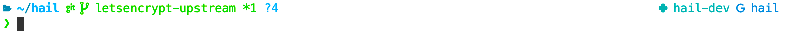

# Terminal

Tips on setting up your terminal and shell.

- [Shell prompt](#shell-prompt)

## Shell prompt

When working with tools like conda, git, gcloud, and Hail, you might need to frequently
switch between conda environments, git branches, Google Cloud projects, and Hail namespaces. It's helpful to always display them in your prompt, as context for an operation:


`zsh` is the default shell on Mac OS. [Powerlevel10k](#powerlevel10k) will work for
`zsh`. See the [custom](#custom) configuration below for `bash` or `zsh`, and [other
shells](#other-shells) for alternatives like `fish`.

### Powerlevel10k

[Powerlevel10k](https://github.com/romkatv/powerlevel10k) is a `zsh` theme with a
great out-of-the-box experience. It comes with lots of [status segments](https://github.com/romkatv/powerlevel10k#batteries-included) by default.

If you want to always show the current `gcloud` project, open `~/.p10k.zsh` and comment out the following line:

```
typeset -g POWERLEVEL9K_GCLOUD_SHOW_ON_COMMAND='gcloud|gcs'
```

If you've installed the Meslo Nerd Font as part of the Powerlevel10k setup and you're
using Visual Studio Code, make sure to update the font setting for the integrated
terminal:

```
"terminal.integrated.fontFamily": "MesloLGS NF"
```

### Custom configuration

Add this into your `.zshrc`, `.bashrc` or analogous:

```sh
git_rev() {
  # Returns current HEAD: either branch, or commit hash if detached.
  if [ ! -d .git ]; then echo ""; fi
  BRANCH=$(git branch --show-current)
  if [ -z $BRANCH ]
    then REV=$(git rev-parse --short HEAD)
    else REV=$BRANCH
  fi
  echo "$REV"
}

gcp_project() {
  # Returns current project, set with `gcloud config set project`.
  # Note: calling `gcloud config get-value project` is very slow, so parsing a file.
  PROJECT=$(grep project ~/.config/gcloud/configurations/config_default | sed 's/project = //')
  echo "$PROJECT"
}

conda_env() {
  # Returns current activated conda environment, assuming it's activated
  # with `conda activate`. For deactivated state, returns "base" or empty string.
  echo "$CONDA_DEFAULT_ENV"
}

hail_namespace() {
  # Returns current hail namespace set with `hailctl dev config set default_namespace`.
  echo "$(cat ~/.hail/deploy-config.json | jq -r ".default_namespace")"
}

_statuses() {
  echo "$(hail_namespace)·$(git_rev)·$(gcp_project)·$(conda_env)"
}

# For zsh:
PROMPT='%~%  $(_statuses) $ '  # %~% resolves to the home directory starting with ~. To show the absolute path, use %/%
# For bash:
PS1='\w  $(_statuses) $ '
```

You can add some colors:

```sh
PROMPT='%{$fg[cyan]%}%~%  %{$fg[yellow]%}$(_statuses)%{$reset_color%} $ '
PS1='\[\033[00;36m\]\w\[\033[00m\] \[\033[00;33m\]$(_statuses)\[\033[00m\] $ '
```

For more details on bash colors, see [this helpful article](https://www.howtogeek.com/307701/how-to-customize-and-colorize-your-bash-prompt).

It can be also useful to use color code to show the last command return value. In zsh, it can be done with:

```sh
PROMPT='%{$fg[cyan]%}%~%  %{$fg[yellow]%}$(_statuses)%{$reset_color%} %(?.%{$fg[green]%}.%{$fg[red]%})%B$%b '
```

Also, if you are using the a zsh [git-prompt plugin](https://github.com/ohmyzsh/ohmyzsh/tree/master/plugins/git-prompt),
you can call `$(git_super_status)` instead of `$(git_rev)`:

```sh
plugins=(<other plugins> git-prompt)
ZSH_THEME_GIT_PROMPT_PREFIX=""  # remove left parenthesis around git_super_status
ZSH_THEME_GIT_PROMPT_SUFFIX=""  # remove right parenthesis around git_super_status
_statuses() {
  echo "$(hail_namespace)·$(git_super_status)·$(gcp_project)·$(conda_env)"
}
```

## Other shells

[Starship](https://starship.rs/) is a cross-shell prompt that works on many shells.

For the `gcloud` status, you'll have to customize its [configuration](https://starship.rs/config/#gcloud) to show the `project` variable.
